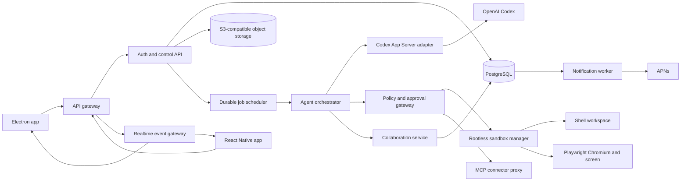

<!-- markdownlint-disable MD013 MD036 -->

# Product Requirements Document: noudleAgents

Status: Draft for implementation  
Version: 1.0  
Date: 2026-08-31  
Product name: **noudleAgents**  
Platforms: Electron desktop, React Native iPhone, hosted control plane  
AI runtime: Codex CLI through Codex App Server  

## 1. Executive summary

noudleAgents is an open-source, self-hostable workspace for persistent AI teammates. A user creates named agents, gives each agent a role and access boundaries, chats with them from desktop or iPhone, watches them work in a browser or terminal, approves sensitive actions, and receives durable results. Agents can discover one another, delegate bounded tasks, exchange context and artifacts, request reviews, and coordinate through a visible task graph.

Electron and React Native are two clients for the same server-owned product. Agent identities, Codex threads, messages, task state, files, skills, routines, approvals, memory, computer sessions, notifications, and settings must remain synchronized. Closing either client must not stop work.

The first release is a private, single-owner alpha hosted on a Linux VPS. It uses the owner's Codex authentication and isolates execution in rootless containers. The architecture must support a later multi-user release, but public signup is out of scope until credential isolation, tenant isolation, abuse controls, billing, and hardened sandboxing are complete.

noudleAgents is inspired by the workflow and information density of Grok Bot, but it is a clean-room product. It must not copy proprietary source code, private APIs, brand assets, exact visual assets, or misleading branding.

## 2. Product vision

### 2.1 Product promise

> Your AI team is always available, shares the right context, works while you are away, and is fully visible and controllable from desktop or iPhone.

### 2.2 Core product loop

1. Create or select a named agent.
2. Assign an objective in chat.
3. The agent plans, uses tools, delegates specialist work when useful, and reports live progress.
4. The user reviews questions and approvals from either device.
5. The agent returns a durable artifact with sources and provenance.
6. The user converts repeatable work into a skill or routine.

### 2.3 Differentiation

- Agents are durable teammates, not disposable prompt presets.
- Collaboration is represented as typed tasks and visible messages, not hidden prompt chaining.
- Desktop and iPhone expose the same server state and controls.
- Codex is the execution engine, with persistent threads rather than a new stateless CLI process per message.
- The product is open source and can be self-hosted.
- Every consequential action passes through one auditable policy and approval layer.

## 3. Problem statement

Current agent tools commonly fail in one or more of these ways:

- Work stops when the local app closes.
- Desktop and mobile histories diverge.
- Agents do not know which other agents exist or what they can do.
- Delegation is hidden, duplicates work, or loops indefinitely.
- Full transcripts are copied between agents, exposing unrelated context and wasting tokens.
- Tool activity is difficult to inspect or interrupt.
- Long-running browser and terminal work lacks durable checkpoints.
- Approvals are vague and can accidentally authorize changed arguments.
- Memories have no evidence or correction path.
- Self-hosting guidance ignores isolation and credential risk.

noudleAgents solves these issues with one durable control plane, an event-sourced sync model, persistent Codex threads, a permissioned collaboration protocol, and isolated execution workers.

## 4. Goals and non-goals

### 4.1 P0 goals

1. One account can use the same agents and data from Electron and iPhone.
2. A named agent retains its identity, role, memory, files, and persistent Codex thread across restarts.
3. Multiple agents can discover one another and delegate work through a visible, bounded workflow.
4. Agents can use a persistent server-side workspace, shell, browser, web search, files, and approved MCP tools.
5. Work continues when all clients are offline.
6. Users can inspect progress, answer questions, approve or deny actions, interrupt work, and take over a browser session remotely.
7. Every task, tool call, approval, handoff, and artifact has an audit trail.
8. The private alpha can run safely on one sufficiently sized Linux VPS.

### 4.2 P1 goals

- Reusable skills.
- Scheduled and webhook-triggered routines.
- Evidence-backed memory synthesis and editing.
- Push notifications.
- Search across agents, chats, tasks, files, links, skills, and routines.
- Structured connector support through MCP.
- Group conversations with two to six agents.

### 4.3 P2 goals

- Teach-by-demonstration.
- Team workspaces, invitations, roles, SSO, and organization policy.
- Public and private agent templates.
- Voice conversation.
- Android, iPad, Windows, and Linux desktop packages.
- Hardened public multi-tenant execution with gVisor, Kata Containers, or Firecracker.

### 4.4 Non-goals for the private alpha

- Training or fine-tuning a proprietary foundation model.
- Exact visual cloning of Grok Bot.
- Sharing one ChatGPT/Codex login with public users.
- Unrestricted autonomous purchases, publishing, deletion, production changes, or account permission changes.
- Perfect offline execution on the phone or desktop. Clients cache data; the VPS executes work.
- Native control of the user's iPhone. The mobile app controls cloud sessions only.
- A plugin marketplace or paid billing system.

## 5. Product principles

### 5.1 Server is authoritative

The VPS owns durable state. Clients hold encrypted session credentials, a local read cache, drafts, optimistic mutations, and device notification tokens. A client must never be the sole owner of a message, task, approval, or agent configuration.

### 5.2 Visible agency

The user can always answer:

- Which agent is working?
- On which task?
- Why was it delegated?
- What context was shared?
- Which tools are active?
- What changed?
- What needs approval?
- How can I stop it?

### 5.3 Least context, not maximum context

Agents know the roster and task graph, but receive only context permitted for their task. Full access to every transcript is neither the default nor required for collaboration.

### 5.4 One action gateway

Shell, browser, filesystem, connectors, and internal collaboration tools emit typed proposed actions. The same policy engine decides allow, deny, or request approval before execution.

### 5.5 Calm, minimal interface

The interface favors content, status, and decisions. It avoids dashboards full of decorative metrics, excessive borders, large gradients, ambiguous icons, and settings mixed into daily work.

### 5.6 Resumable by design

Runs checkpoint after meaningful events. Worker restarts, client disconnects, and temporary network failures must not duplicate external side effects.

## 6. Users and primary jobs

### 6.1 Initial user

A technical owner or small team running a private self-hosted instance. They understand that agents can execute code and access connected accounts, and they want direct control over data and infrastructure.

### 6.2 Future users

- Founder coordinating research, operations, product, and engineering agents.
- Developer delegating implementation, testing, review, and documentation.
- Operator running recurring reports and browser workflows.
- Researcher collecting sources and producing reviewable artifacts.
- Team lead managing specialist agents with scoped access.

### 6.3 Primary jobs to be done

- “Give a persistent specialist a task and continue later from any device.”
- “See what my agents are doing without reading raw logs.”
- “Let a lead agent split a goal across specialists without losing ownership.”
- “Approve sensitive work from my phone.”
- “Reuse a successful process on a schedule.”
- “Take over when login, CAPTCHA, payment, or human judgment is required.”

## 7. Scope and priority model

Requirements use these priorities:

- **P0**: required for private alpha.
- **P1**: required for useful beta.
- **P2**: later parity or scale work.

Release cannot be called cross-device if a P0 state type exists only on one client.

## 8. Information architecture

### 8.1 Primary objects

- Workspace
- User
- Device
- Agent
- Conversation
- Message
- Run
- Task
- Delegation
- Context reference
- Artifact
- Computer session
- Tool call
- Approval
- Memory
- Skill
- Routine
- Connector
- Notification
- Audit event

### 8.2 Desktop navigation

The Electron app uses a compact three-region layout:

```text
┌──────────────┬───────────────────────────────────┬──────────────────┐
│ Workspace    │ Conversation / task               │ Context panel    │
│              │                                   │                  │
│ + New        │ Agent header + live state         │ Task             │
│ Agents       │ Message timeline                  │ Agent team       │
│ Groups       │ Tool and delegation cards         │ Files            │
│ Tasks        │ Approval cards                    │ Computer         │
│ Routines     │                                   │ Activity         │
│              │ Composer                          │                  │
├──────────────┴───────────────────────────────────┴──────────────────┤
│ Connection · queued work · active approvals · token/cost budget    │
└────────────────────────────────────────────────────────────────────┘
```

- Left rail: 232 px default, 64 px collapsed.
- Main conversation: fluid, 640 px minimum readable width.
- Context panel: 320 px default, collapsible, tabbed.
- Bottom status strip: 28 px; hidden when no operational state is useful.
- Window minimum: 1,080 × 720. Below this width the context panel becomes a drawer.

### 8.3 iPhone navigation

The React Native app uses four bottom tabs:

1. **Chats**: agents, groups, unread and attention states.
2. **Tasks**: active task graph, approvals, blockers, completed work.
3. **Computer**: live cloud screens, takeover, keyboard, pointer, and return control.
4. **Library**: files, skills, routines, connectors, memory, and settings.

Global search opens from the top-right of Chats and Tasks. Agent creation is a compact sheet from the Chats header. Notifications deep-link directly to the exact message, task, approval, or computer session.

The mobile app must not be a reduced “companion” app. It supports every server-side workflow. Platform-only actions differ:

- Desktop may authorize commands on the local Mac through a separate local-execution bridge.
- iPhone can control the cloud computer but cannot execute arbitrary commands on the phone.
- Dense configuration screens use full-screen mobile forms rather than desktop side panels.

## 9. Visual and interaction design

### 9.1 Direction

The design is **quiet operational minimalism**: dark, precise, information-dense, and warm enough to avoid looking like a terminal skin. It may resemble Grok Bot's product category and familiar chat structure, but all tokens, components, assets, layout decisions, and motion are original.

The memorable element is the collaboration trace: a thin living thread visually connects parent tasks, delegated work, artifacts, and returned results without turning the chat into a project-management dashboard.

### 9.2 Color tokens

```text
canvas              #0B0C0E
surface-1           #111317
surface-2           #171A1F
surface-hover       #1D2127
border-subtle       #272B32
border-strong       #383E47
text-primary        #F1F3F5
text-secondary      #A4AAB3
text-muted          #6F7681
accent              #D7FF64
accent-quiet        #263019
info                #74B9FF
success             #72D6A0
warning             #F3C66D
danger              #FF7D84
focus               #C5E1FF
```

Rules:

- No large decorative gradients.
- Accent is reserved for selected state, primary action, running indicator, and focus moments.
- Status never depends on color alone; include text, icon, or motion.
- Contrast meets WCAG 2.2 AA for normal text and controls.

### 9.3 Typography

- UI/body: **Geist Sans** or another open, neutral grotesk with tabular numerals.
- Code/logs: **Berkeley Mono** only if licensing permits distribution; default open-source fallback **IBM Plex Mono**.
- Desktop base: 14 px / 20 px.
- Mobile base: 16 pt / 22 pt.
- Conversation text: 15 px desktop, 16 pt mobile.
- Headings use weight and spacing, not oversized type.

### 9.4 Geometry

- Control radius: 8 px.
- Cards: 10 px.
- Sheets and dialogs: 14 px.
- Spacing scale: 4, 8, 12, 16, 24, 32.
- Minimum desktop control height: 32 px.
- Minimum mobile touch target: 44 × 44 pt.
- One-pixel borders, minimal shadows, no glassmorphism.

### 9.5 Motion

- Standard transition: 140–180 ms.
- Drawers and sheets: 220–260 ms with restrained spring easing.
- New streamed content fades in without moving older content unexpectedly.
- Running status uses a low-amplitude pulse, not an infinite spinner.
- Delegation trace animates once when created, then becomes static.
- Reduced-motion preference removes movement while preserving state changes.

### 9.6 Core components

- Agent avatar with presence/status ring.
- Agent row with name, role, unread state, and one-line current task.
- Message bubble only for user-authored content; agent content sits directly on timeline.
- Tool call card with tool, intent, status, duration, expandable input/output, and approval binding.
- Delegation card with sender, recipient, objective, shared context, status, budget, and returned artifact.
- Task card with owner, parent, dependencies, status, blockers, and cost.
- Approval card with exact action, target, arguments, risk explanation, expiry, approve once, deny, and optional rule creation.
- Artifact card with type preview, version, authoring agent, source task, and download/share actions.
- Composer with text, attachments, mentions, skill command, voice dictation, and send/interrupt state.
- Command palette/search with keyboard and touch parity.

### 9.7 Loading, empty, error, and offline states

- Skeletons preserve final geometry.
- Empty screens include one direct action and no marketing prose.
- Recoverable errors stay attached to the failed object with Retry and Details.
- Offline clients remain readable from cache, allow drafts, and clearly queue safe mutations.
- Actions requiring current authority—approvals, takeover, interrupts, connector writes—are disabled offline.
- Reconnection replays events from the last acknowledged cursor before submitting queued mutations.

## 10. Screen requirements

### 10.1 Authentication and instance connection — P0

- Support email magic link or passkey for app authentication.
- Private alpha may use one owner account created at deployment.
- Electron can connect by instance URL and browser-based login.
- iPhone supports universal-link login and stores refresh tokens in Keychain.
- Show instance identity before authentication to prevent signing into a spoofed server.
- Device management lists sessions and supports remote revocation.

### 10.2 Onboarding — P0

Maximum four steps:

1. Connect to or confirm noudleAgents instance.
2. Verify Codex runtime authentication status.
3. Create the first agent from a minimal name/role form or a local template.
4. Run a harmless capability check and explain approval behavior.

Do not ask users to configure routines, connectors, memory, or collaboration before they complete one successful chat.

### 10.3 Agent roster — P0

- List agents by recency, pinned state, unread state, and attention requirement.
- Show name, role, current status, current task, and last activity.
- Statuses: idle, queued, planning, working, waiting for agent, waiting for user, blocked, paused, failed, completed.
- Create, edit, duplicate, archive, and delete an agent.
- Delete requires confirmation and explains treatment of threads, tasks, files, and memory.
- Agent profile defines role, operating instructions, capabilities, default workspace, enabled tools, context scope, budget, and approval policy.
- Agent detail includes tabs for Overview, Conversations, Tasks, Memory, Skills, Routines, Access, and Activity.

### 10.4 Conversation — P0

- Durable messages with optimistic send and idempotency key.
- Stream assistant text and normalized activity events.
- Accept text, images, files, links, replies, and mentions.
- Show questions, plans, tool activity, delegation, approvals, artifacts, and errors inline.
- User can steer a running turn, interrupt the current turn, or stop a task tree.
- Jump to latest is visible only when scrolled away.
- Drafts sync per user and conversation; newest explicit edit wins with a recoverable previous draft.
- Search opens at exact matching message.
- A conversation can be one-to-one, a group, or a task-linked operational thread.

### 10.5 Group conversation — P0

- Add two to six agents.
- Mention one, multiple, or all agents.
- One agent is the current response owner; ownership is visible and transferable.
- Agents may volunteer only when routing policy permits and must avoid duplicate responses.
- Inter-agent messages and handoffs remain visible.
- Group mute, archive, and notification controls sync across devices.

### 10.6 Task board and graph — P0

- Views: My attention, Active, Waiting, Completed, Failed.
- Each task has objective, owner, creator, parent, dependencies, status, priority, budget, deadline, context references, artifacts, approvals, and timestamps.
- Desktop shows list plus optional dependency graph.
- Mobile shows a nested task list; graph opens in a pan/zoom full-screen view.
- Users can reassign ownership, pause, resume, cancel, retry, and inspect the activity timeline.
- Cancelling a parent offers “parent only” or “entire unfinished subtree.”
- Task state changes are transactional and evented.

### 10.7 Computer — P0

- Show one live cloud screen per active graphical session.
- Display controlling agent, task, URL/app, resolution, connection quality, and control lease.
- Watch mode is read-only.
- Takeover pauses agent input, transfers the lease, and records the event.
- Return control explicitly resumes the agent.
- Remote keyboard includes Escape, Tab, arrows, modifiers, clipboard paste, and secure text entry.
- Secure text entry is not persisted to transcript, screenshots, analytics, or model context.
- Mobile supports pinch zoom, pan, tap, long press, drag, and a precision pointer mode.
- Expired/disconnected sessions show the last safe frame with reconnect, not a misleading live indicator.

### 10.8 Approvals — P0

- Central inbox plus inline cards.
- Risk categories: external communication, publish, purchase/payment, delete, overwrite, permission/security, production, account/authentication, sensitive-data access, and custom policy.
- The approval binds to normalized tool, target, arguments, actor agent, task, and expiry.
- Any material argument change invalidates approval.
- Decisions: approve once, deny, and optional narrowly scoped rule creation on desktop. Mobile initially supports approve once and deny; rule authoring is P1.
- Approval notifications avoid sensitive argument values on the lock screen.

### 10.9 Files and artifacts — P0

- Upload, preview, download, rename, version, and attach files.
- Store originals in object storage; metadata and provenance in PostgreSQL.
- Agent filesystem paths are references to mounted object-backed or durable workspace content.
- Every produced artifact records producing run, task, agent, version, checksum, MIME type, source references, and visibility scope.
- Preview text, Markdown, code, images, PDF, CSV, JSON, audio, and video where supported.
- Office preview is P1; original download remains available.

### 10.10 Skills — P1

- Create manually or from a completed run.
- Define trigger description, required inputs, steps, validations, expected output, tools, and approval boundaries.
- Version every change and allow rollback.
- Enable globally, per workspace, or per agent.
- Test in a sandbox before enabling.

### 10.11 Routines — P1

- Schedule by date/time/recurrence and time zone.
- Trigger by signed webhook.
- Select owner agent, skill/instruction, inputs, output destination, retry policy, budget, and approval policy.
- Test performs real work and clearly warns the user.
- Pause, resume, run now, edit, duplicate, and delete.
- Run history shows status, inputs, outputs, approvals, failures, cost, and duration.
- Webhook deliveries are verified and deduplicated.

### 10.12 Search — P1

- Search agents, conversations, messages, tasks, files, links, skills, routines, and settings.
- Support type and date filters.
- Enforce authorization before retrieval and ranking.
- Keyword search ships first; semantic search is an optional enhancement.

### 10.13 Settings — P0/P1

- Account and devices.
- Instance connection and version.
- Appearance and accessibility.
- Notification controls.
- Codex authentication and runtime health.
- Default approval policy.
- Data export and account deletion.
- Storage use and retention.
- Connectors and secrets.
- Admin and infrastructure health for owner accounts.

## 11. Functional requirements

### 11.1 Agent lifecycle — P0

Each agent has:

- Stable ID, name, avatar, role, description, and operating instructions.
- Capability declarations used for discovery and routing.
- Tool and connector allowlist.
- Context visibility scope.
- Default approval profile.
- Token, cost, wall-time, delegation-depth, and fan-out budgets.
- Persistent Codex thread ID and runtime state.
- Optional default project/workspace directory.
- Current status, task, heartbeat, and last error.
- Evidence-backed durable memories.
- Enabled skills and routines.

Agent creation must be transactional. If Codex thread initialization fails, preserve the draft agent and mark runtime setup as incomplete rather than creating a half-working invisible record.

### 11.2 Agent awareness — P0

Every agent can query an internal, permission-filtered directory containing:

- Agent ID and name.
- Role and concise capability summary.
- Availability and current workload band.
- Accepted task types.
- Context scopes the requesting agent may share.
- Delegation permissions and budget limits.

Agents must not rely on a stale roster embedded in their permanent prompt. The directory is queried through typed tools at decision time.

### 11.3 Collaboration protocol — P0

Codex agents receive an internal collaboration toolset through a local MCP server or equivalent typed App Server tool bridge:

```text
list_agents(filters?)
inspect_agent(agent_id)
list_tasks(filters?)
read_task(task_id)
create_task(parent_task_id?, objective, acceptance_criteria, budget)
delegate_task(task_id, agent_id, context_refs, message)
accept_task(task_id)
reject_task(task_id, reason)
message_agent(agent_id, task_id?, message, context_refs?)
request_context(task_id, refs_or_scope, reason)
grant_context(request_id, refs, expiry?)
request_review(task_id, reviewer_agent_id, artifact_ids)
attach_artifact(task_id, artifact_id)
transfer_ownership(task_id, agent_id)
report_blocker(task_id, blocker, needs_user)
complete_task(task_id, summary, artifact_ids, evidence_refs)
```

All tools validate actor, workspace, task state, context scope, budget, and policy server-side. Model-provided IDs and paths are untrusted input.

### 11.4 Delegation lifecycle — P0

1. Coordinator discovers a suitable agent.
2. Coordinator creates a child task with objective and acceptance criteria.
3. Coordinator selects explicit context references and artifacts.
4. Policy engine validates depth, fan-out, cycle risk, budget, permissions, and recipient availability.
5. Scheduler claims the child task and resumes the recipient's Codex thread.
6. Recipient accepts or rejects with a visible reason.
7. Recipient works, may request additional context, and checkpoints progress.
8. Recipient completes with a summary, evidence, and artifacts or reports a blocker.
9. Coordinator receives a durable event, reviews the output, and continues the parent task.

Delegation never transfers all private history implicitly.

### 11.5 Context package — P0

```json
{
  "taskId": "task_child_123",
  "parentTaskId": "task_root_101",
  "fromAgentId": "agent_coordinator",
  "toAgentId": "agent_researcher",
  "objective": "Verify the hosting constraints for the private alpha.",
  "acceptanceCriteria": [
    "Use primary sources",
    "State what could not be verified",
    "Return a plan verdict"
  ],
  "constraints": ["Read-only", "Do not expose credentials"],
  "contextRefs": ["message_88", "artifact_architecture_4"],
  "artifactRefs": [],
  "budget": {
    "maxTokens": 50000,
    "maxWallSeconds": 900,
    "maxChildTasks": 0
  },
  "replyToRunId": "run_441"
}
```

Context reference resolution happens just before the run and records exactly which versions were provided.

### 11.6 Collaboration safety — P0

- Maximum delegation depth: default 3, hard maximum 6.
- Maximum direct children per task: default 4, hard maximum 8.
- Detect cycles across parent, dependency, review, and ownership edges.
- An agent cannot delegate a task back to an ancestor without explicit user approval.
- One active owner per task.
- A task cannot complete while required child tasks remain unfinished.
- Child budgets cannot exceed remaining parent budget.
- Delegation cannot broaden tool, connector, filesystem, network, or context permissions.
- A user can stop one agent turn, one task, or an entire task subtree.
- All agent-to-agent messages are visible in the activity timeline.
- Scheduler applies exponential backoff and a dead-letter state after bounded retries.

### 11.7 Runs and turns — P0

- One run belongs to one agent, conversation, and optional task.
- Only one interactive turn may mutate a given agent's Codex thread at a time.
- New user input may queue, steer the current turn, or interrupt it based on explicit UI action.
- Background tasks use separate queued runs but preserve ordering for one agent thread.
- A run records state, checkpoint cursor, worker lease, model served, usage, cost estimate, and error.
- Worker leases expire and can be reclaimed safely.
- Side-effecting tool calls require idempotency keys derived from stable operation IDs.

### 11.8 Memory — P1

Memory categories:

- Agent role and operating preferences.
- User preferences.
- Project facts.
- Reusable procedural knowledge.
- Relationship and collaboration notes.

Every memory requires source references, confidence, creation time, last-confirmed time, visibility scope, and optional expiry. Memory synthesis runs after completed turns, proposes changes, and validates evidence. Users can inspect, edit, pin, reject, or forget memories. Sensitive values and transient secrets must never become memories.

### 11.9 Tool execution — P0

Initial typed tools:

- Read/write/list files within authorized mounts.
- Apply patch.
- Run shell commands in a sandbox.
- Start and control Playwright Chromium.
- Fetch URLs and search the web.
- Read and write artifacts.
- Request user input.
- Request approval.
- Internal collaboration tools.
- MCP tool proxy for explicitly enabled servers.

Tool output is size-capped. Large results become artifacts with concise summaries. Shell processes have timeouts, output limits, environment filtering, and process-tree termination.

### 11.10 Local desktop execution — P1

Electron may run a separate local bridge that exposes narrowly scoped commands to the server:

- Disabled by default.
- Requires device authentication.
- Shows exact command, working directory, environment changes, and affected paths.
- Modes: never, ask every time, or rule-based allow.
- The server cannot silently convert cloud permission into local permission.
- Local results are uploaded as events/artifacts with redaction.

React Native does not expose a comparable arbitrary local execution bridge.

## 12. Cross-device synchronization

### 12.1 Source of truth — P0

PostgreSQL is the authoritative store for product records and ordered event cursors. Object storage is authoritative for file bytes. Worker filesystems are execution state, not the only copy of important artifacts.

### 12.2 Event model — P0

All clients subscribe to a workspace event stream using WebSocket for bidirectional live state, with an SSE fallback for restricted networks. Every durable event has:

```json
{
  "id": "evt_01K...",
  "workspaceId": "ws_01K...",
  "aggregateType": "task",
  "aggregateId": "task_123",
  "sequence": 42,
  "type": "task.delegated",
  "actor": {"type": "agent", "id": "agent_lead"},
  "payload": {},
  "createdAt": "2026-08-31T18:12:00Z"
}
```

- Cursor is monotonic within a workspace event partition.
- Client persists its last acknowledged cursor.
- Reconnect requests all events after that cursor.
- Events are at-least-once; reducers are idempotent.
- Sensitive payload fields are redacted or replaced with server-fetched protected detail.
- Ephemeral token deltas may be streamed without permanent storage; final message chunks are durable.

### 12.3 Client cache — P0

- Electron: encrypted SQLite cache.
- React Native: encrypted SQLite cache plus Keychain credentials.
- Shared TypeScript sync package defines reducers, optimistic mutations, cursor handling, and conflict rules.
- Caches are disposable and reconstructable from the server.
- Remote logout destroys local tokens and protected cache keys.

### 12.4 Optimistic mutations — P0

Safe optimistic actions include message send, draft save, reaction, archive, pin, and notification preference. Each uses a client-generated operation ID and idempotency key.

Approval decisions, task cancellation, ownership transfer, connector changes, and destructive file operations require an online server response before the UI shows success.

### 12.5 Conflict rules — P0

- Messages are append-only; edits create versions.
- Agent profiles and routine definitions use version checks and field-level conflict feedback.
- Task state uses allowed server transitions, never last-write-wins.
- Drafts use per-device versions and preserve a recoverable conflicting draft.
- Pins, reactions, read cursors, and notification preferences use deterministic merge rules.
- User-facing timestamps come from the server; clients may display pending local time until acknowledged.

### 12.6 Push notifications — P1

APNs notifications are generated from durable attention events:

- Approval required.
- User answer required.
- Task completed or failed.
- Delegated work blocked.
- Routine failed.

Payloads contain opaque IDs and minimal preview text. Opening a notification authenticates, fetches current state, and deep-links to the object. Duplicate event IDs must not generate duplicate notifications.

## 13. Codex runtime integration

### 13.1 Chosen integration — P0

Use `codex app-server` for the rich interactive product integration. It supports authentication, persistent conversation history, streamed agent events, approvals, and thread lifecycle primitives. Use the Codex SDK later for isolated non-interactive jobs if it simplifies a worker flow.

Do not run a fresh `codex exec` for every follow-up message. That path is acceptable only for an early smoke test or stateless job. Each noudleAgents agent maps to a persistent Codex thread and resumes it across worker restarts.

Official references:

- [Codex App Server](https://developers.openai.com/codex/app-server/)
- [Codex SDK](https://developers.openai.com/codex/sdk/)
- [Codex authentication](https://developers.openai.com/codex/auth/)
- [Codex non-interactive mode](https://developers.openai.com/codex/noninteractive/)

### 13.2 Process model — P0

Private alpha:

- One owner identity.
- One Codex runtime service on the VPS.
- One persistent Codex thread per noudleAgents agent.
- Thread and turn operations serialized per agent.
- Multiple agent turns execute concurrently within configured VPS limits.
- Browser and shell tools execute in agent/task sandbox containers, not in the control API container.

Future multi-user release:

- Credentials and App Server processes are isolated per user or workload identity.
- Never expose one user's Codex credentials to another user's worker.
- Never use the project owner's ChatGPT login as a shared public backend credential.
- Support user-provided API keys, organization-managed workload identity, or another explicitly permitted authentication model.

### 13.3 Thread mapping — P0

```text
noudleAgents agent ID -> Codex thread ID -> active turn ID -> normalized run events
```

Store Codex IDs as runtime references, not as the only conversation record. noudleAgents retains its own canonical messages, tasks, events, approvals, and artifacts so the product remains inspectable and migration-capable.

Required lifecycle behavior:

- Create: `thread/start`.
- Continue: `thread/resume`, then `turn/start`.
- Interrupt: `turn/interrupt`.
- Optional later branch: `thread/fork`.
- Persist IDs only after successful acknowledgement.
- Reconcile missing/archived threads with a clear recovery state; never silently attach the wrong thread.

### 13.4 Event adapter — P0

Translate App Server events into stable internal events:

- Agent text delta and final message.
- Reasoning/progress summary when exposed.
- Plan update.
- Command proposed, started, output, completed, failed.
- File change proposed/applied.
- MCP call proposed/completed.
- Web search and fetch activity.
- Approval requested/resolved.
- User input requested/resolved.
- Usage update.
- Turn completed/interrupted/failed.

Store raw protocol payloads only in restricted debug logs with retention limits. Product clients consume normalized versioned schemas.

### 13.5 Prompt and tool boundary — P0

The agent's runtime context includes:

1. Product-level safety and collaboration contract.
2. Workspace policy.
3. Agent role and capabilities.
4. Current task and acceptance criteria.
5. Selected context references and memory.
6. Current tool schemas and permissions.
7. User message.

The model does not decide final authorization. Tool requests are proposals until the policy gateway approves them.

### 13.6 Codex authentication — P0

Private alpha may authenticate the Codex CLI once on the VPS using the owner's permitted account flow. Credentials must be readable only by the runtime service account and excluded from backups unless encrypted.

For a future distributed product:

- API keys remain server-side and encrypted.
- User tokens never enter model prompts, agent filesystems, logs, analytics, or client bundles.
- Key rotation and revocation are supported.
- Usage attribution and limits are per user/workspace.
- Product terms and OpenAI account rules must be reviewed before public launch.

### 13.7 Provider abstraction — P2

Codex is the only required engine for the first release. Keep an internal `AgentRuntime` interface around start/resume/turn/interrupt/event normalization so other open or local runtimes can be added without rewriting the product. Do not delay the MVP to implement multiple providers.

## 14. System architecture



### 14.1 Monorepo layout

```text
apps/
  desktop/             Electron main, preload, renderer
  mobile/              React Native with Expo development builds
services/
  control-api/         HTTP API, auth, authorization, mutations
  realtime-gateway/    WebSocket/SSE streams and presence
  agent-worker/        Codex App Server adapter and run execution
  scheduler/           leases, routines, retries, notifications
  sandbox-manager/     rootless containers and computer sessions
  connector-proxy/     MCP/OAuth boundary and secret isolation
packages/
  protocol/            schemas, event types, API contracts
  api-client/          generated typed clients
  sync-engine/         cursor, cache reducers, optimistic operations
  agent-state/         domain transitions and selectors
  policy/              action schemas and policy evaluation
  design-tokens/       shared color, type, spacing, motion tokens
  validation/          shared Zod schemas
  test-fixtures/       deterministic events and fake runtimes
infra/
  compose/             private-alpha deployment
  migrations/          database migrations
  caddy/               TLS and reverse proxy
docs/
  architecture/
  threat-model/
```

### 14.2 Technology choices

| Area | Choice | Reason |
| --- | --- | --- |
| Desktop | Electron, React, Vite, TypeScript | Cross-platform, mature desktop APIs, shared web logic |
| Mobile | React Native, Expo development builds, TypeScript | Native iOS UX, APNs/Keychain support, shared logic packages |
| API | Node.js TypeScript with Fastify | Small surface, schema support, streaming friendly |
| Database | PostgreSQL | Transactions, JSONB, full-text search, advisory locks |
| Queue | PostgreSQL-backed durable jobs initially | Reduces operational systems for MVP |
| Realtime | WebSocket, SSE fallback | Bidirectional interaction plus robust fallback |
| Object storage | S3-compatible | Durable files, presigned upload/download, portability |
| Sandbox | Rootless Docker/Podman containers | Practical private-alpha isolation on VPS |
| Browser | Playwright Chromium, Xvfb, noVNC/WebRTC gateway | Automation plus user-visible takeover |
| Reverse proxy | Caddy | Simple automatic TLS and WebSocket support |
| Validation | Zod and generated OpenAPI schemas | Shared runtime validation |
| Observability | OpenTelemetry, structured logs, Prometheus-compatible metrics | Trace runs across services |

### 14.3 Deployment units for private alpha

- `caddy`
- `control-api`
- `realtime-gateway`
- `scheduler`
- `agent-worker`
- `sandbox-manager`
- `postgres`
- Optional `minio` for local S3-compatible storage
- Optional `otel-collector`

Services may initially share one TypeScript codebase and deploy as fewer processes, but boundaries and database ownership must remain clear.

## 15. Data model

### 15.1 Core tables

```text
users
devices
sessions
workspaces
workspace_members
agents
agent_capabilities
agent_runtime_refs
conversations
conversation_members
messages
message_versions
runs
run_events
tasks
task_dependencies
task_context_refs
delegations
artifacts
artifact_versions
computer_sessions
tool_calls
approvals
approval_rules
memories
memory_evidence
skills
skill_versions
routines
routine_versions
routine_runs
connectors
connector_grants
notifications
webhook_receipts
audit_events
```

### 15.2 Task state machine

```text
draft -> queued -> accepted -> running -> waiting_agent
                                  |       -> waiting_user
                                  |       -> blocked
                                  |       -> paused
                                  |       -> completed
                                  |       -> failed
                                  |       -> cancelled
```

Only the server transitions state. Completion requires acceptance criteria status and any required output references.

### 15.3 Context scopes

- **private**: visible only to owner/user and explicitly granted agents.
- **agent**: agent's own conversations and memory.
- **project**: agents assigned to a project.
- **team**: all agents in the workspace.
- **public artifact**: explicitly exported; never automatic.

Authorization is checked when context is referenced and again when it is resolved for a run.

### 15.4 Artifact provenance

Every artifact version stores:

- Producing agent, run, and task.
- Parent artifact/version when derived.
- Content hash and size.
- MIME type and storage key.
- Source URLs, messages, or files.
- Visibility scope.
- Creation and retention timestamps.
- Malware scan status in hosted mode.

## 16. API outline

```text
POST   /v1/auth/magic-link
POST   /v1/auth/refresh
DELETE /v1/devices/:id/session

GET    /v1/agents
POST   /v1/agents
GET    /v1/agents/:id
PATCH  /v1/agents/:id
POST   /v1/agents/:id/duplicate
POST   /v1/agents/:id/archive

GET    /v1/conversations
POST   /v1/conversations
GET    /v1/conversations/:id/messages
POST   /v1/conversations/:id/messages
POST   /v1/runs/:id/steer
POST   /v1/runs/:id/interrupt

GET    /v1/tasks
POST   /v1/tasks
GET    /v1/tasks/:id
PATCH  /v1/tasks/:id
POST   /v1/tasks/:id/delegate
POST   /v1/tasks/:id/pause
POST   /v1/tasks/:id/resume
POST   /v1/tasks/:id/cancel

GET    /v1/approvals
POST   /v1/approvals/:id/approve
POST   /v1/approvals/:id/deny

POST   /v1/uploads
GET    /v1/artifacts/:id
GET    /v1/artifacts/:id/download

GET    /v1/computers
POST   /v1/computers/:id/takeover
POST   /v1/computers/:id/return-control
POST   /v1/computers/:id/secure-input

GET    /v1/skills
POST   /v1/skills
POST   /v1/skills/from-run/:runId

GET    /v1/routines
POST   /v1/routines
POST   /v1/routines/:id/test
POST   /v1/routines/:id/pause
POST   /v1/routines/:id/resume

POST   /v1/hooks/:hookId
GET    /v1/search
GET    /v1/events?after=<cursor>
WS     /v1/realtime
```

Mutating endpoints accept `Idempotency-Key`. All list endpoints use cursor pagination. Error responses include stable codes, request IDs, safe user messages, and restricted operator detail.

## 17. Hosting and deployment

### 17.1 Hostinger account audit result

The current Hostinger subscription is **not verified**. The provided JSON contains `your-token-here`, not a usable API token. The read-only audit found no `HOSTINGER_API_TOKEN`, registered Hostinger MCP server, Codex MCP configuration, or saved Hostinger MCP OAuth credential on this machine.

Do not paste a real Hostinger API token into chat or commit it to this repository. To inspect the account later, connect Hostinger's remote MCP using browser OAuth or provide the token to the local process through a protected environment/secret store. The inspection should remain read-only until a deployment is explicitly authorized.

### 17.2 Hostinger plan suitability

Checked against Hostinger's published limits on 2026-08-31:

| Plan | Published resources | noudleAgents verdict |
| --- | ---: | --- |
| Web or Cloud hosting | No root/sudo and no arbitrary Docker control | Not suitable |
| KVM 1 | 1 vCPU, 4 GB RAM, 50 GB NVMe, 4 TB transfer | Not suitable |
| KVM 2 | 2 vCPU, 8 GB RAM, 100 GB NVMe, 8 TB transfer | Below CPU minimum |
| KVM 4 | 4 vCPU, 16 GB RAM, 200 GB NVMe, 16 TB transfer | Recommended private MVP |
| KVM 8 | 8 vCPU, 32 GB RAM, 400 GB NVMe, 32 TB transfer | Recommended small trusted beta |

Published plan reference: [Hostinger hosting plan parameters and limits](https://support.hostinger.com/en/articles/6976044-parameters-and-limits-of-hosting-plans-in-hostinger).

Hostinger advertised KVM 4 at a US introductory equivalent of $12.99/month and a two-year renewal equivalent of $28.99/month, and KVM 8 at $25.99/month introductory and $49.99/month renewal when checked. Pricing is generally paid upfront, varies by account and region, and must be confirmed in hPanel before purchase: [Hostinger VPS pricing](https://www.hostinger.com/vps-hosting).

### 17.3 Private MVP recommendation

Use **Hostinger KVM 4** if the existing subscription matches or exceeds it:

- Ubuntu LTS.
- Docker Engine and Compose, with rootless agent containers where practical.
- Caddy for TLS and reverse proxy.
- PostgreSQL on a private Compose network.
- Encrypted VPS volume where available plus application-level secret encryption.
- Local object storage for active alpha artifacts and an independent S3-compatible provider for off-host backups.
- Weekly VPS backup plus daily database dumps and artifact replication off-host.
- Hostinger firewall allowing only 22 from an operator IP/VPN, 80, and 443; prefer SSH through Tailscale and close public 22.
- Monitoring and alerts for disk, memory, CPU, database health, worker leases, TLS, backup completion, and failed routines.

Hostinger supports VPS root access, Docker/Compose, persistent volumes, PostgreSQL in containers, DNS pointing, and Let's Encrypt-compatible TLS. Relevant documentation:

- [Self-managed VPS capabilities](https://www.hostinger.com/support/8852150-what-is-a-self-managed-vps-at-hostinger/)
- [Hostinger Docker Manager](https://www.hostinger.com/support/12040789-hostinger-docker-manager-for-vps-simplify-your-container-deployments/)
- [VPS backups and snapshots](https://www.hostinger.com/support/1583232-how-to-back-up-or-restore-a-vps-at-hostinger/)
- [Point a domain to a VPS](https://www.hostinger.com/support/1583227-how-to-point-a-domain-to-your-vps-at-hostinger/)
- [Install SSL on a VPS](https://www.hostinger.com/support/6360129-how-to-install-ssl-on-vps-at-hostinger/)

### 17.4 Capacity assumptions

Codex model inference runs remotely, so VPS load comes mainly from API services, PostgreSQL, file processing, Codex/App Server processes, Chromium sessions, screen streaming, and shell containers.

Initial operational caps on KVM 4:

- Four simultaneously running non-browser agent turns.
- Two simultaneous browser-heavy graphical sessions.
- One video/large-document processing job at a time.
- Eight queued background runs before warning the user about capacity.
- Suspend idle Chromium sessions after 10 minutes while preserving durable state.

These are engineering starting points, not guarantees. Instrument per-run CPU, peak RSS, disk I/O, browser count, and event latency. Raise caps only after load tests and real measurements. KVM 8 is the next step when normal work repeatedly exceeds 70% CPU, 75% memory, or acceptable queue latency.

### 17.5 Isolation limitation

Hostinger states that nested virtualization is disabled: [Hostinger nested virtualization policy](https://www.hostinger.com/support/10429687-is-nested-virtualization-supported-in-hostinger/).

Consequences:

- Rootless containers are viable for a private single-owner alpha or trusted small team.
- Firecracker microVM workers cannot run on Hostinger VPS.
- Containers share the host kernel and are not a sufficient boundary for arbitrary untrusted public code.
- A public multi-tenant product may keep the stateless control plane on Hostinger, but untrusted execution workers must move to microVM-capable infrastructure, dedicated hosts, or a specialized sandbox provider.

### 17.6 Backup and recovery

- PostgreSQL: nightly logical dump, continuous WAL/archive strategy by beta, and encrypted off-host copy.
- Object storage: versioning or immutable backup where supported.
- Secrets: separate encrypted export with documented restore; never plain in VPS snapshots.
- Configuration: infrastructure files in Git, secrets injected at deployment.
- Recovery objective for private alpha: RPO 24 hours, RTO 4 hours.
- Recovery objective for beta: RPO 15 minutes, RTO 1 hour.
- Run quarterly restore drills; a backup is not accepted until restoration is tested.

### 17.7 Environments

- **Local development**: local PostgreSQL/MinIO or adapters, fake Codex runtime for deterministic UI tests, optional real Codex smoke tests.
- **Staging**: isolated domain, database, storage bucket, and credentials; synthetic data only.
- **Production alpha**: owner data and real connectors; protected deployment approvals.

Never point a development client at production by default.

## 18. Security and privacy requirements

### 18.1 Threat model baseline — P0

Threats include:

- Malicious web pages, emails, documents, files, tool output, and MCP servers attempting prompt injection.
- Agent-generated destructive or overly broad commands.
- Cross-agent or future cross-tenant data leakage.
- Stolen mobile/desktop sessions.
- Leaked Codex, connector, Hostinger, database, or storage credentials.
- SSRF and arbitrary network egress.
- Container escape or access to the Docker socket.
- Approval confusion or time-of-check/time-of-use changes.
- Delegation loops and cost exhaustion.
- Replay of webhooks, messages, approvals, or external writes.
- Secrets captured in screenshots, logs, transcripts, artifacts, or backups.

### 18.2 Authentication and sessions — P0

- Short-lived access tokens and rotating refresh tokens.
- Refresh tokens bound to device records and stored in Keychain/safe storage.
- Passkey support preferred; email links expire quickly and are one-time use.
- Revoke individual or all devices.
- Rate-limit and audit authentication attempts.
- Require recent authentication for secret reveal, export, account deletion, and administrative actions.

### 18.3 Authorization — P0

- Every record includes workspace ownership or derives it through a verified relation.
- Authorization is enforced server-side for HTTP, realtime subscriptions, artifact downloads, computer streams, and tool calls.
- Use deny-by-default scopes.
- Signed download URLs are short-lived and bound to authorized artifacts.
- Context access is rechecked at run time.

### 18.4 Secrets — P0

- Envelope-encrypt secrets using a master key outside the database.
- Separate secret metadata from values.
- Never mount the full secret store into agent containers.
- Connector proxy injects a value only into the exact outbound request.
- Redact known values and patterns from logs and events.
- Secure-input channel bypasses model and transcript storage.
- Rotation, revocation, last-used audit, and access purpose are visible.

### 18.5 Sandbox — P0

- Run as non-root with dropped Linux capabilities.
- Rootless container where supported.
- Read-only base image and explicit writable mounts.
- No Docker/Podman socket inside agent containers.
- Seccomp/AppArmor profile.
- PID, memory, CPU, disk, process, and wall-time limits.
- Network disabled by default, then allowlisted per task/tool.
- Normalize and validate paths against authorized mount roots.
- Kill the full process tree on timeout/interruption.
- Rebuild disposable environments from pinned images.

### 18.6 Prompt-injection defense — P0

- Mark browser, email, document, connector, and tool output as untrusted data.
- Never place untrusted text into system/developer instruction layers.
- Policy engine, not model text, controls permissions.
- External instructions cannot request secrets or broaden scope.
- High-risk actions require a concise user-visible explanation tied to the initiating task.
- Add adversarial tests for web pages that instruct the agent to upload keys, disable protections, or contact unrelated targets.

### 18.7 Approval integrity — P0

Approval signature covers:

```text
workspace + actor agent + task + tool + normalized target + normalized arguments
+ data classification + risk type + expiration + operation id
```

Execution recomputes the signature immediately before the action. Any mismatch creates a new approval request. “Always allow” rules must be narrow, human-readable, reversible, and subordinate to mandatory-deny policies.

### 18.8 Audit — P0

Append-only audit events cover:

- Login and device changes.
- Agent/profile/policy changes.
- Context grants.
- Delegation and ownership transfer.
- Tool proposals and outcomes.
- Approval requests and decisions.
- Secret access metadata.
- Connector changes.
- Artifact export/deletion.
- Routine changes and runs.
- Deployment/admin changes.

Audit views redact secret values but retain actor, target, reason, time, and result.

### 18.9 Data lifecycle — P1

- Export workspace messages, tasks, configurations, memories, and artifacts.
- Define retention separately for debug logs, run events, audit logs, deleted content, and backups.
- Soft-delete user content for a short recovery window; clearly state backup deletion lag.
- Provide permanent delete with progress and final report.
- Do not use user content to train a custom model without explicit separate consent.

## 19. Non-functional requirements

### 19.1 Performance

- Cached app launch to usable state: under 2 seconds p95 on supported hardware.
- API response for normal reads: under 300 ms p95 within the hosting region.
- Message acknowledgement: under 500 ms p95.
- Realtime event visibility on another connected device: under 1.5 seconds p95.
- First streamed agent activity after worker availability: under 3 seconds p95, excluding provider latency.
- Approval decision propagation: under 1 second p95.
- Search response: under 1 second p95 for 100,000 indexed records.
- Computer control input-to-visible-frame target: under 250 ms p50 on a healthy connection; warn above 600 ms.

### 19.2 Reliability

- Private alpha control-plane target: 99.5% monthly availability.
- Beta target: 99.9% excluding planned maintenance.
- No acknowledged message, approval, or task transition may be lost after process restart.
- Worker retries must not duplicate a side effect.
- Event stream reconnect must recover from cursor without requiring full logout.

### 19.3 Scale targets

Private alpha:

- 1 user.
- 25 agents.
- 100,000 messages/events.
- 4 concurrent non-browser runs.
- 2 concurrent browser sessions.
- 200 GB active storage ceiling with warnings at 70%, 85%, and 95%.

Small beta architecture target:

- 100 users.
- 2,500 agents.
- 50 concurrent runs.
- 20 concurrent browser sessions across worker hosts.
- Horizontal realtime and worker services.

### 19.4 Accessibility

- WCAG 2.2 AA target.
- Full keyboard navigation on desktop.
- VoiceOver labels and ordered focus on iPhone.
- Visible focus ring.
- Dynamic Type through at least accessibility large sizes.
- Reduced motion and increased contrast support.
- Status and risk never encoded only by color.
- Computer view provides textual agent/task status even when the visual stream is inaccessible.

### 19.5 Compatibility

- macOS Apple silicon is the first Electron target.
- iPhone requires iOS 18 or later for initial release.
- Server targets Ubuntu LTS x86-64.
- Windows desktop packaging is P2 unless explicitly reprioritized.

### 19.6 Observability

- Correlation ID across user operation, API request, task, run, Codex turn, tool call, and artifact.
- Structured logs with redaction.
- Metrics for queue age, run duration, first-event latency, event lag, App Server failures, browser memory, approvals, retries, cost, and backup status.
- Distributed traces for slow or failed runs.
- Health dashboard that separates provider, control plane, database, storage, sandbox, and client connectivity.

## 20. Analytics and success metrics

Collect privacy-conscious product analytics on the self-hosted instance; default to no third-party analytics for private alpha.

### 20.1 North-star metric

**Weekly completed, user-accepted tasks that produced a durable result or verified external outcome.**

### 20.2 Activation

- User creates first agent.
- First message receives a completed Codex response.
- First tool run completes.
- First approval is resolved.
- Second device connects and displays the same history.
- First successful agent-to-agent delegation.

### 20.3 Quality

- User acceptance rate of completed tasks.
- Retry and failure rate.
- Percentage of outputs with artifacts/evidence when required.
- Delegation acceptance and completion rate.
- Duplicate work or cycle-prevention events.
- Approval denial rate and reason.
- Memory correction/rejection rate.

### 20.4 Reliability and efficiency

- Queue latency and run duration.
- Tokens/cost per accepted task.
- Browser steps versus structured tool calls.
- Worker recovery success.
- Cross-device event lag.
- Side-effect deduplication count.
- Idle container suspension savings.

## 21. Delivery plan

Time estimates assume one experienced full-stack developer using Codex heavily. Security review, Apple distribution, and public multi-tenancy require additional time and specialist review.

### Phase 0 — Repository and contracts, week 1

- Choose final name and license; Apache-2.0 recommended.
- Create pnpm monorepo and shared TypeScript configuration.
- Define domain schemas, events, state machines, and API conventions.
- Add PostgreSQL migrations and local adapters.
- Add fake runtime and deterministic event fixtures.
- Create threat model and security reporting policy.

Exit: automated tests can create a workspace, agent, conversation, task, and event stream entirely with fake services.

### Phase 1 — Shared control plane and Codex, weeks 2–4

- Auth, devices, agents, conversations, messages, runs, and events.
- Codex App Server process manager and persistent thread mapping.
- Stream normalized events.
- Interrupt and user-input flow.
- Initial policy gateway and audit log.
- Minimal Electron shell and chat.

Exit: create an agent, exchange persistent follow-ups, restart services, resume the correct Codex thread, and see identical durable history.

### Phase 2 — Collaboration MVP, weeks 5–6

- Tasks, dependencies, ownership, context references, and artifacts.
- Internal collaboration MCP tools.
- Agent directory and capability routing.
- Delegation scheduler, budgets, cycle prevention, messages, blockers, and review.
- Desktop roster, task views, and delegation cards.

Exit: a coordinator discovers a specialist, delegates a bounded child task, receives an evidence-backed result, and completes the parent with the entire trace visible.

### Phase 3 — Sandboxed tools and computer, weeks 7–9

- Rootless shell/file container.
- Playwright Chromium and persistent authorized workspace.
- Live screen transport and takeover lease.
- Tool cards, approvals, secure input, artifact upload.
- Network and filesystem policy.

Exit: an agent researches a site, creates a cited Markdown artifact, asks before an external side effect, and survives client disconnect.

### Phase 4 — React Native parity, weeks 10–12

- Expo development-build app.
- Shared protocol, API client, sync engine, validation, design tokens, and domain selectors.
- Chats, task graph/list, approvals, files, computer watch/takeover, settings, offline cache, drafts, and deep links.
- APNs setup.

Exit: start work on Electron, approve from iPhone, take over the cloud browser, return control, and see completion plus artifacts on both devices without manual refresh.

### Phase 5 — Skills, routines, search, and memory, weeks 13–15

- Skills and versioning.
- Cron/webhook routines and history.
- Full-text search.
- Evidence-backed memory synthesis and editor.
- Connector proxy and initial MCP integrations.

Exit: convert a successful run into a skill, execute it from a signed event while clients are offline, and review the synchronized result later.

### Phase 6 — Hosted alpha hardening, weeks 16–18

- Hostinger KVM 4 staging and production Compose deployments.
- Off-host backups and restore drill.
- Rate limits, egress policy, malware scanning decision, log redaction, dashboards, and alerts.
- Electron signing/update flow and TestFlight distribution.
- Security review and adversarial test suite.

Exit: private alpha passes launch checklist and rollback/restore rehearsal.

## 22. MVP acceptance tests

### 22.1 Cross-device

1. Create an agent on Electron; it appears on iPhone within 1.5 seconds.
2. Send a message from iPhone; Electron displays the same message, run, and streamed result.
3. Edit agent instructions on one device; the other receives the versioned update.
4. Kill and restart both clients; all messages, tasks, drafts, and read states recover.
5. Simulate offline mobile use; cached content remains readable and a draft survives reconnection.

### 22.2 Codex persistence

1. Agent establishes a fact in one turn and uses it correctly in a later resumed turn.
2. Restart the agent worker and App Server adapter; resume the mapped thread.
3. Never attach an agent to another agent's thread.
4. Interrupt a turn and record the final interrupted state on both clients.
5. Approval and input requests resolve back to the correct turn.

### 22.3 Multi-agent collaboration

1. Coordinator lists agents and selects one by capabilities.
2. Delegation creates a child task with explicit context and budget.
3. Specialist works in its own Codex thread.
4. Specialist requests one missing context item; unauthorized context is denied.
5. Specialist returns an artifact and evidence.
6. Coordinator receives the result and completes the parent.
7. Both clients display task lineage, inter-agent messages, shared context, artifacts, cost, and status.
8. A cycle attempt is rejected.
9. Stopping the task subtree interrupts unfinished descendant runs.

### 22.4 Tools, approval, and computer

1. Agent cannot access a path outside authorized mounts.
2. Agent cannot reach a blocked network destination.
3. Any changed action argument invalidates prior approval.
4. Duplicate worker delivery executes one external side effect.
5. User takeover pauses agent input immediately.
6. Secure input never appears in transcript, logs, screenshots, or model context.
7. Closing both clients does not stop the server-side run.

### 22.5 Recovery

1. Restart API, realtime gateway, scheduler, worker, and database separately during test runs.
2. Reclaim expired worker leases without duplicate completion.
3. Restore database and artifacts from backup into staging.
4. Reconnect clients from old cursors and receive exactly the missing durable events.
5. Surface an actionable error when Codex credentials expire.

## 23. Testing strategy

- Unit tests for state machines, reducers, authorization, policies, budget math, redaction, and event normalization.
- Contract tests generated from schemas for API, WebSocket, mobile, desktop, and worker adapters.
- Integration tests with PostgreSQL, object storage, fake Codex App Server, and fake MCP servers.
- Recorded protocol fixtures for App Server event changes.
- End-to-end Electron tests with Playwright.
- React Native component tests plus Maestro/Detox device flows.
- Sandbox escape and path traversal tests.
- Prompt-injection corpus for browser/document/connector content.
- Chaos tests for process death, dropped events, duplicate jobs, delayed approvals, and expired leases.
- Load tests for streaming fan-out, task queues, PostgreSQL locks, and concurrent Chromium memory.
- Manual VoiceOver, keyboard, Dynamic Type, reduced-motion, and poor-network tests.
- Restore drills and signed-build installation tests before release.

## 24. Release gates

### 24.1 Private alpha

- All P0 acceptance tests pass.
- Threat model reviewed.
- No critical/high unresolved security findings.
- Codex credential expiry and recovery tested.
- Database and artifact restore tested.
- Electron and TestFlight builds install on real devices.
- Cross-device sync tested on Wi-Fi, cellular, disconnect, and app termination.
- Infrastructure monitoring and disk alerts active.
- Public signup disabled.

### 24.2 Small trusted beta

- P1 features required by target testers pass.
- Per-user credential and data isolation implemented.
- External worker strategy chosen for untrusted code.
- Abuse limits, quotas, and cost attribution active.
- Privacy policy, terms, data export/deletion, and incident process complete.
- Independent security review complete.

## 25. Risks and mitigations

| Risk | Impact | Mitigation |
| --- | --- | --- |
| Codex App Server protocol changes | Runtime breakage | Pin tested version, protocol adapter, fixtures, compatibility tests, controlled upgrades |
| ChatGPT/Codex credential model unsuitable for public SaaS | Blocks launch | Private alpha only; design per-user/workload identity before beta |
| Hostinger container isolation is insufficient for untrusted code | Security breach | Trusted alpha only; external microVM workers for public execution |
| Chromium consumes VPS memory | Queue delays/crashes | Hard concurrency caps, suspend idle sessions, memory telemetry, KVM 8 upgrade path |
| Delegation loops or duplicate work | Cost and poor UX | Task graph, one owner, depth/fan-out/budget caps, cycle detection |
| Excess context leaks data and wastes tokens | Privacy/cost | Explicit context refs, scoped grants, summaries, server authorization |
| Prompt injection causes harmful tool proposals | Account/data damage | Typed tools, untrusted labels, policy gateway, approvals, egress restrictions |
| Cross-device conflicts | Lost settings/confusing state | Server transitions, versions, idempotency, cursor replay, conflict UI |
| Approval fatigue | Users approve blindly | Narrow policies, risk grouping, exact diffs, rule suggestions only after repetition |
| VPS loss corrupts or removes data | Data loss | Off-host database/artifact backups and restore drills |
| Product is perceived as a Grok Bot clone | Legal/brand risk | Original name, clean-room implementation, original UI/assets/copy, clear non-affiliation |
| iOS background restrictions | Missed live work | Server executes tasks; APNs notifies; client reconnects rather than running agents locally |

## 26. Open decisions

These do not block repository setup but must be resolved before relevant milestones:

1. Final product name and domain.
2. Apache-2.0 versus another open-source license.
3. Exact current Hostinger subscription after secure read-only connection.
4. External S3-compatible storage provider and region.
5. Private-alpha authentication: passkey, magic link, or both.
6. Screen transport: noVNC/WebSocket first versus WebRTC first.
7. Whether agent filesystem is one shared owner workspace with separate task directories or separate persistent volumes per agent. Recommended alpha: shared project artifacts plus isolated task working directories.
8. Mobile distribution initially through TestFlight only or public App Store.
9. Retention periods for debug events, deleted content, and backups.
10. When to add an alternative non-Codex runtime.

## 27. First implementation backlog

The first ten build tickets should be:

1. Initialize pnpm monorepo, formatting, linting, tests, CI, license, and contribution files.
2. Define Zod schemas for agents, conversations, messages, tasks, runs, events, approvals, and artifacts.
3. Add PostgreSQL migrations and repository layer.
4. Build authenticated event append/read API with idempotency and cursor replay.
5. Implement fake agent runtime and deterministic stream fixtures.
6. Build Codex App Server process manager, handshake, thread start/resume, turn start/interrupt, and event normalization.
7. Build Electron shell with dark design tokens, roster, conversation timeline, and composer.
8. Add task state machine, collaboration service, and internal typed tools.
9. Implement two-agent delegation end to end using separate Codex threads.
10. Add React Native shell using the shared API client, sync engine, cache, tokens, and first cross-device chat test.

Sandbox/browser work starts after the collaboration proof is stable, so failures can be attributed to the right layer.

## 28. Definition of done

A feature is done only when:

- Server contract and authorization are implemented.
- Electron and iPhone behavior is implemented when the feature is server-side.
- Loading, empty, error, offline, and permission-denied states exist.
- Accessibility behavior is verified.
- Durable events, audit events, metrics, and redaction are correct.
- Unit/contract/integration tests pass.
- Relevant real app/device flow is manually verified.
- Documentation and migration notes are updated.
- No unreviewed secret or production mutation is required to use it.

Build success alone is not visual, synchronization, security, or device acceptance.

## 29. Source basis

Product behavior research and clean-room architecture are documented in [GROK_BOT_RESEARCH_AND_OPEN_SOURCE_ARCHITECTURE.md](./GROK_BOT_RESEARCH_AND_OPEN_SOURCE_ARCHITECTURE.md).

Primary external references:

- [Grok Bot overview](https://docs.x.ai/grok-bot/overview)
- [Grok Bot chat and collaboration](https://docs.x.ai/grok-bot/chat-and-collaboration)
- [Grok Bot computer and apps](https://docs.x.ai/grok-bot/computer-and-apps)
- [Grok Bot skills and routines](https://docs.x.ai/grok-bot/skills-routines-and-automations)
- [Grok Bot approvals, security, and privacy](https://docs.x.ai/grok-bot/approvals-security-and-privacy)
- [Grok Bot for iOS](https://docs.x.ai/grok-bot/mobile)
- [Official OpenAI Codex App Server documentation](https://developers.openai.com/codex/app-server/)
- [Official OpenAI Codex SDK documentation](https://developers.openai.com/codex/sdk/)
- [Official OpenAI Codex authentication documentation](https://developers.openai.com/codex/auth/)
- [Official OpenAI Codex non-interactive mode documentation](https://developers.openai.com/codex/noninteractive/)
- Hostinger documentation linked in section 17.

## 30. Final product decision

Build noudleAgents as a server-owned, cross-device agent operating system—not as two separate chat apps. Electron and React Native share protocols, sync logic, state transitions, validation, design tokens, and product behavior while retaining platform-appropriate UI components.

Use persistent Codex App Server threads as the intelligence layer. Use a separate collaboration control plane for agent discovery, tasks, permissions, context exchange, artifacts, budgets, and audit. Use Hostinger KVM 4 for the private single-owner MVP if the securely verified subscription matches it. Do not place arbitrary public multi-tenant execution on the same Hostinger container host.

The MVP is proven only when this complete loop works:

> Start a task on Electron → coordinator delegates to a specialist → specialist works in its own Codex thread and cloud sandbox → user approves from iPhone → specialist returns an artifact → coordinator completes the parent → every message, task, approval, file, cost, and status is identical on both devices.
