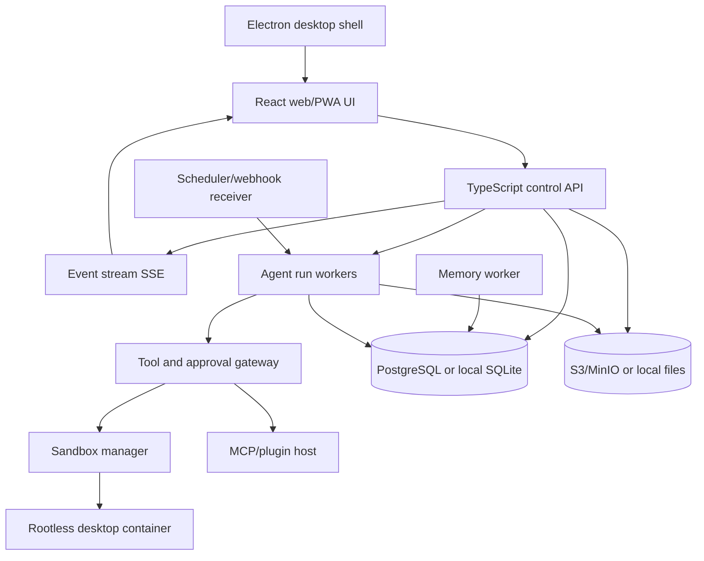

<!-- markdownlint-disable MD013 MD036 -->

# Reference product research and open-source implementation architecture

Research date: 2026-08-31  
Product researched: SpaceXAI/xAI **Grok Bot**, launched in early beta on 2026-08-11  
Purpose: define a clean-room, open-source product with the same job-to-be-done, without copying proprietary code, branding, or private APIs.

## Executive summary

Grok Bot is not the normal Grok chat assistant. It is a messaging-style interface for persistent, named AI teammates. Each teammate has a role, conversation, memory, access to tools, and the ability to work in a browser, terminal, and filesystem after the user's device is closed.

The most important technical correction is this:

- Marketing describes each Bot as having a computer.
- The technical documentation says **one managed Linux VM is assigned to each user**. All of that user's Bots share its filesystem, browser sign-ins, CLI credentials, and permissions.
- Each Bot gets a separate graphical screen on the shared VM, allowing parallel computer-use tasks. Those screens are work surfaces, not security boundaries.

The product combines seven systems:

1. Persistent chat and agent profiles.
2. A durable agent runtime that can continue in the cloud.
3. A browser/desktop/terminal computer-use layer.
4. API tools through plugins, connectors, and MCP.
5. Long-term memory, skills, and teach-by-demonstration.
6. Scheduled and event-triggered routines.
7. An approval gateway for consequential actions and human-only authentication.

The exact proprietary backend is not public. This document therefore separates:

- **Confirmed**: stated in official product documentation.
- **Observed**: present in the current downloadable desktop client, but not always documented as generally available.
- **Inferred**: the most likely implementation based on public behavior and client structure.
- **Proposed**: the recommended clean-room implementation for this project.

## 1. What Grok Bot is

SpaceXAI describes Grok Bot as a team of always-on agents that can sign in to tools, work across apps and websites, finish multi-step jobs, collaborate with other Bots, and request approval when necessary. The same Bots and conversations are available on desktop and iPhone. Work runs on cloud infrastructure, so closing the app or laptop does not end an active turn or routine.

This differs from a standard assistant in four ways:

- **Durability**: a Bot has a stable identity, job, conversation, memory, files, and environment.
- **Action**: it works in actual tools, rather than only returning instructions or drafts.
- **Asynchrony**: work can run for a long time and finish while the user is offline.
- **Coordination**: Bots can message one another, work in groups, and hand off ownership.

Official overview: [Grok Bot overview](https://docs.x.ai/grok-bot/overview) and [launch announcement](https://x.ai/news/introducing-grok-bot).

## 2. Public feature inventory

### 2.1 Bot identity and roster

**Confirmed**

- Create a named Bot with a name, title/job, description, and avatar.
- Give each Bot a long-lived operational role and standing boundaries.
- Up to 50 Bots and group chats combined per account.
- Edit a Bot's profile.
- Pin, hide, unhide, and delete a Bot.
- Duplicate a Bot. The copy includes profile, settings, enabled skills, routines, and avatar, but not conversation history, learned memory, or chat attachments.
- Share a Bot through a public template link. A recipient receives a copy of its public configuration, not the original user's history, machine, or sign-ins.
- Existing Bots can suggest or create another focused Bot.
- A Bot can retain stable preferences, role context, important facts, and summaries of prior work.

Source: [Create and manage Bots](https://docs.x.ai/grok-bot/bots).

### 2.2 Messaging and conversation

**Confirmed**

- Text chat with streaming activity.
- Paste text, links, and images.
- Attach files.
- Mention a Bot, group, routine, or connector with `@`.
- Reference a saved skill with `/`.
- Reply to a specific message in a thread.
- React to messages.
- Send a new instruction while work is running; direct user input has priority over background work.
- Send “Stop now” to interrupt current work. This does not undo completed actions.
- The transcript includes normal messages plus tool activity, computer activity, files, questions, approvals, and handoffs.
- Search or command-palette access to Bots, groups, messages, files, links, routines, settings, and common actions, subject to rollout availability.
- Attention states distinguish working, typing, unread results, and requests needing attention.

Source: [Message and collaborate](https://docs.x.ai/grok-bot/chat-and-collaboration).

### 2.3 Multi-Bot collaboration

**Confirmed**

- Create a group chat containing two to six Bots.
- Address one Bot, several Bots, or `@everyone`.
- Bots can decide who should respond when the user does not mention a specific owner.
- Bots can post in a shared group and pass work between themselves.
- A Bot can asynchronously message another Bot. The receiving Bot wakes, handles the request, and replies later.
- Handoffs remain visible in the conversation.
- Shared files in `/workspace` provide another handoff mechanism.
- Bot-to-group handoff messages are currently text-only; direct Bot-to-Bot delivery is needed when the receiving Bot must inspect an image.

A good implementation should enforce one owner for each stage and cap handoff depth. Unlimited self-delegation creates duplicate work, token waste, and loops.

### 2.4 Persistent cloud computer

**Confirmed**

- Each user receives a managed Linux virtual machine.
- Every Bot belonging to the user shares that VM.
- Shared state includes browser cookies/sessions, files, CLI credentials, and installed resources.
- Each Bot gets its own screen and may run one computer-use task on that screen at a time.
- Multiple Bots can reason, use connectors, manipulate files, and use separate screens in parallel.
- The machine provides a browser, terminal, filesystem, and a durable `/workspace` directory.
- Users can watch clicks, typing, navigation, and current status from an Agent Computer view.
- Cloud work continues while the local app is closed.
- Browser sign-ins generally persist.
- Update or recovery can replace the runtime image while retaining durable state.
- Reset can return to the latest durable snapshot and lose recent unsynced work.
- Bots run as a non-root Linux user.
- Static egress IPs are available for enterprise network allowlisting.

Sources: [Use the computer and apps](https://docs.x.ai/grok-bot/computer-and-apps) and [Teams and enterprises](https://docs.x.ai/grok-bot/teams-and-enterprises).

### 2.5 Human takeover and local-computer execution

**Confirmed**

- A user can take control of the cloud screen.
- Passwords, passkeys, two-factor codes, CAPTCHAs, payments, identity checks, and explicitly human-only steps should be completed by the user.
- Secure secret requests can collect a value without adding it to the transcript or showing it to the model.
- A Bot may separately request access to the Mac or Windows computer in front of the user.
- Local execution can be set to never allow, ask every time, or always allow. The documented default is ask every time.
- Local actions pass through Auto Review and display the exact command.
- Hardware-key WebAuthn prompts from the cloud browser can be forwarded to the desktop and physical key; Windows support was still in progress in the reviewed documentation.

The cloud VM and local device must be treated as separate trust domains.

### 2.6 Files and generated results

**Confirmed**

Accepted inputs include:

- Images, audio, and video.
- PDF and text documents.
- Word, Excel, and PowerPoint documents.
- CSV, JSON, YAML, source code, HTML, email files, and Jupyter notebooks.
- Pasted links and images.

Documented desktop limits are six attachments per message, 25 MB per document/image/audio file, and 200 MB per video. The product displays files, images, links, and tool results as previewable cards. Bots can produce documents, spreadsheets, slide decks, screenshots, logs, folders, messages, source-linked recommendations, and other artifacts.

Files written to `/workspace` are visible to all Bots. Important results should also be attached or linked in the conversation, because manually installed packages, temporary directories, and uncommitted application state are replaceable.

Source: [Files and results](https://docs.x.ai/grok-bot/files-and-results).

### 2.7 Connectors, plugins, MCP, and browser fallback

**Confirmed**

- Connectors appear as Plugins in the current app.
- Plugins can contain structured service connections and packaged skills.
- Users discover them in a marketplace and review installed items under “Yours.”
- `@` attaches a connector to a task.
- Connector tools can be enabled or disabled individually.
- Installed connectors are account-wide rather than isolated to one Bot.
- Teams can require or restrict plugins.
- Grok Bot inherits Cursor team plugin and MCP policies, including server allowlists/denylists and restrictions on user-added servers.
- MCP authentication is shared across Cursor and Grok Bot.
- For hosted MCP servers, sign-in tokens remain on Cursor's backend. The backend runs tool calls on the computer's behalf, so the VM does not store those tokens.
- When no structured connector exists, a Bot can operate the service through the browser.
- An official X connector can search posts, read timelines, inspect mentions, and retrieve activity through the X API.

Prefer APIs/MCP for deterministic data operations and browser computer use for visual or unsupported paths. Browser automation should not be the default when a reliable structured tool exists.

Sources: [Use the computer and apps](https://docs.x.ai/grok-bot/computer-and-apps), [Teams and enterprises](https://docs.x.ai/grok-bot/teams-and-enterprises), and [Grok Bot works with X](https://x.ai/news/grok-bot-and-x).

### 2.8 Skills

**Confirmed**

A skill is a reusable procedure containing:

1. When to use it.
2. Required inputs and access.
3. Steps and decision rules.
4. Validation rules.
5. Expected output.
6. Approval boundaries.

Skills are reusable across Bots, although private skills can be enabled per Bot and the necessary login/connector must still be available. A completed one-time task can be converted into a skill through chat.

### 2.9 Teach-by-demonstration

**Confirmed, gradual rollout**

- In a one-to-one Bot conversation, the user can open the computer and choose **Teach a task**.
- The user describes the intended result and performs a browser workflow once.
- Visible computer interaction can be recorded for up to ten minutes; microphone audio is not recorded.
- The system creates a draft skill.
- The user reviews, corrects, and tests it before scheduling.

One demonstration cannot express every branch. The generated skill must add failure behavior, approval rules, variable inputs, validation, and stable semantic selectors.

### 2.10 Routines and event automation

**Confirmed**

- A routine assigns a workflow to one Bot and runs it on a schedule or supported event.
- The schedule uses the configured time zone.
- Background routines run while the user's device is closed.
- Cursor account integrations can trigger routines from events such as Slack messages and GitHub notifications.
- Users can test, enable, pause, edit, inspect, and delete routines.
- Run history shows recent successes and failures.
- Each Bot can own up to 50 routines; the app keeps the 20 most recent run records per routine.
- A test run performs real work, so approvals still apply.
- The product can pause unattended routines after a long period without user activity to prevent wasted spend.
- Good routines define stale/no-data behavior, explicit failure reporting, idempotent retry behavior, and a review boundary.

**Observed in desktop client 0.30.0**

- A minimum five-minute separation for routine schedules.
- Schedule, webhook, Slack, GitHub, Microsoft Teams, Linear, and PagerDuty trigger UI and strings.
- Linear events include issue creation, status changes, and cycle completion.
- PagerDuty events include triggered, acknowledged, escalated, changed, and resolved incidents.
- GitHub copy references pull requests, comments, issues, and CI.
- Webhooks use a URL plus a secret/header authorization flow.

Source for public behavior: [Skills and routines](https://docs.x.ai/grok-bot/skills-routines-and-automations).

### 2.11 Memory and learning

**Confirmed**

- A Bot retains stable preferences, role context, important facts, and summaries from earlier work.
- Bots have separate conversations and learned roles.
- Shared files, group messages, and direct handoffs move selected context between Bots.
- Memory is not authoritative. Consequential decisions should reopen the live source.
- Users can explicitly correct a stale assumption.

**Observed in desktop client 0.30.0**

- The client contains a memory-synthesis workflow with proposal validation, evidence references, stale-state detection, retry/requeue behavior, and rejection of invalid proposals.

**Likely interpretation**

The service does not simply stuff the full transcript into every prompt. It likely keeps a short role memory and conversation summary, retrieves relevant prior material, and periodically proposes durable memory updates based on evidence from completed turns.

### 2.12 Approval and safety controls

**Confirmed**

- A Bot can present a proposed operation and arguments before executing it.
- Desktop offers allow once, deny, and—when policy permits—always allow.
- iPhone offers approve once and deny.
- Auto Review evaluates tool calls and computer actions before execution where enforcement is enabled.
- Narrow “require approval” and “always allow” rules are supported; require-approval wins if both match.
- Auto Review is model-based and is explicitly not a replacement for least privilege.
- Recommended approval targets include sending, publishing, purchasing, transferring money, deleting, overwriting, changing permissions, changing production systems, and accepting legal terms.
- An approval applies to the proposed future action; it does not reverse earlier work.

Source: [Approvals, security, and privacy](https://docs.x.ai/grok-bot/approvals-security-and-privacy).

### 2.13 Notifications and status

**Confirmed**

- Per-Bot desktop/mobile notification preference.
- Notifications for results, questions, approval requests, and handoffs.
- Sidebar and dock badges for unread activity.
- Notifications are normally suppressed while the app is focused.
- Errors can expose a request ID for support.
- Push notification rollout can differ by account.
- Optional notification sounds are visible in the reviewed desktop client.

### 2.14 Desktop and mobile clients

**Confirmed**

- Desktop: macOS Apple silicon/Intel and Windows x64/Arm64.
- Mobile: iPhone on iOS 18 or later.
- At the reviewed launch, Linux desktop, Android, and iPad were unsupported.
- iPhone supports text, dictation, photos, files, mentions, groups, threads, reactions, approvals, computer viewing/takeover, search, and routine pause/resume.
- Editing routine definitions/history/testing and teach-by-demonstration require desktop.
- Drafts are saved per conversation on iPhone.

Source: [Grok Bot for iOS](https://docs.x.ai/grok-bot/mobile).

### 2.15 Team and enterprise administration

**Confirmed**

- Cursor authentication, team membership, and SSO are reused.
- Existing team privacy mode, MCP configuration, plugins, and team rules apply.
- Administrators can provide a managed setup script for user VMs.
- Cloud Agents can be controlled by a team-wide toggle.
- Organization admins can inspect and remove member computers while retaining durable storage.
- Team rules can be scoped to Cursor, Grok Bot, or both.
- Plugin/MCP servers can be restricted through allowlists and denylists.
- Team plugin variables can supply secrets without placing them in setup instructions.
- Spend and usage are visible in the dashboard.
- An action-level administrative audit view was documented as “coming,” not available.
- A Grok-Bot-specific spend cap was also not yet available.

### 2.16 Model routing and usage

**Confirmed**

- The product does not expose a user or admin model picker in the documented enterprise behavior.
- Each surface routes through a fixed managed set of models with automatic failover.
- Usage analytics record the model that actually served the request, including failovers.
- Billing follows the serving model.
- The public subscription includes a weekly allowance and can offer on-demand usage depending on the plan.

Pricing and plan eligibility change quickly. Use the [current product page](https://x.ai/bot) rather than encoding prices in the clone.

### 2.17 Additional features observed in the desktop client

Static inspection of the official macOS application, version 0.30.0, found the following user-facing capabilities. Some may be experimental or feature-gated, so they should not be presented as universally released Grok Bot features:

- Live voice calls with a Bot, voice-call transcripts, and voice input.
- Channels in addition to direct Bot chats and groups.
- A dedicated Slack app/channel connection flow.
- Bot templates with import, publish, team-only/public visibility, versioning, and deletion.
- Private skill publishing and team skill targets.
- Global search across messages, files, links, routines, Bots, groups, and actions.
- Browser-cookie import with per-origin approval.
- Disk Saver that audits VM storage and proposes cleanup for approval.
- Scheduled agent-computer image updates.
- Cursor cloud-agent launch and monitoring.
- Subagent lifecycle operations.
- Rich previews for PDF, Office documents, spreadsheets, code, diagrams, math, audio, and video.

This client evidence is useful for product planning, but it does not prove availability for every plan or account.

### 2.18 Use-case surface

The official catalog listed 56 roles across General, Sales, Marketing, Customer Success/Support, Recruiting/People, Operations/Finance, Product, Engineering, and Life/Leverage. Examples include Chief of Staff, Sales Outbound, Paid Media, Account Health, Talent Scout, Expense Manager, Bug Reproduction, Product Performance, Inbox Manager, Contract Desk, Cloud Agent Orchestrator, Security Questionnaire Filler, Travel Coordinator, and Vendor Portal Operator.

These are configurations of the same underlying platform, not separate backend features. The full live list is on the [official use-case page](https://x.ai/bot/use-cases).

## 3. How the proprietary backend appears to work

### 3.1 Confirmed system boundary

```mermaid
flowchart LR
    D[Desktop or iPhone client] --> C[Cursor-authenticated control plane]
    C --> O[Bot orchestration and model routing]
    O --> VM[Managed Linux VM per user]
    VM --> S1[Bot screen A]
    VM --> S2[Bot screen B]
    VM --> W[/workspace and durable user state]
    O --> MCP[Hosted MCP and connector proxy]
    MCP --> APPS[External services]
    O --> P[Approval and Auto Review]
    O --> Q[Routine scheduler and event listeners]
    O --> M[Conversation and memory services]
    D <-->|live events and takeover| C
```

Known facts:

- The app authenticates with Cursor.
- One managed Linux VM belongs to one user.
- Bots share files and sign-ins but receive separate screens.
- Hosted MCP tokens remain on the backend.
- Bots and conversations sync across desktop and iPhone.
- Work continues independently of client connectivity.
- Models are selected and failed over by the service.

### 3.2 Likely request lifecycle

The following is **inferred**, not disclosed source code:

1. The client app appends a user message to a durable conversation stream.
2. A control-plane service creates a run and leases it to an agent worker.
3. The worker assembles context from the Bot profile, standing rules, recent transcript, retrieved memory, attached files, selected skill, mentioned connectors, and current team policy.
4. A model router selects an allowed model for the task surface.
5. The agent emits assistant text, tool calls, computer actions, questions, files, or delegation messages as append-only run events.
6. Structured connector calls go through a hosted token proxy. Browser, terminal, and filesystem work goes to the user's VM/screen.
7. Proposed actions pass through policy and Auto Review. A blocked action creates an approval event and suspends the run.
8. The client receives live events through a long-lived stream and can redirect, approve, deny, take over, or stop the run.
9. At completion, artifacts are attached, summaries are stored, memory updates may be proposed, notifications are sent, and routine receipts are recorded.

### 3.3 Likely compute design

**High-confidence inference**

- A VM manager creates/replaces a standard Linux image per user.
- Durable data is mounted separately from the disposable boot image. This explains why updates can reinstall the OS image while retaining `/workspace` and supported sign-ins.
- Each Bot screen is probably an isolated graphical session/display inside the same OS account or VM, controlled by a remote desktop/browser automation service.
- An agent worker communicates with an in-VM daemon that exposes typed operations for screen capture, pointer/keyboard input, shell execution, file transfer, and process status.
- A lease prevents two computer-use tasks from controlling the same Bot screen simultaneously.

**Unknown**

- VM provider and hypervisor.
- Whether screens use X11, Wayland, browser-only CDP sessions, VNC/RDP, or a proprietary protocol.
- Exact snapshot cadence and which browser state is persisted.
- Whether the primary agent loop runs inside the VM or on a separate backend worker.
- Exact browser-profile synchronization used across concurrent screens.

### 3.4 Likely event and state model

The UI needs to reconstruct long-running activity after reconnecting on another device. The simplest compatible design is an append-only event log:

- `user_message`
- `assistant_delta`
- `assistant_message`
- `tool_requested`
- `tool_started`
- `tool_result`
- `computer_frame`
- `artifact_created`
- `approval_requested`
- `approval_resolved`
- `question_requested`
- `handoff_sent`
- `handoff_received`
- `run_failed`
- `run_completed`

Materialized views can generate the sidebar state, unread status, current run, conversation transcript, routine history, and attention badge. Append-only events also make retries and audits safer than mutating a single “current response” row.

### 3.5 Likely memory pipeline

The client contains explicit references to memory synthesis, evidence, validation, stale-state detection, and rejected proposals. A plausible pipeline is:

1. A completed turn emits candidate evidence.
2. A small model proposes additions, edits, or removals to durable memory.
3. Every proposal cites message/run evidence.
4. A validator rejects unsupported, malformed, sensitive, or conflicting changes.
5. Optimistic version checks prevent applying a proposal to memory that changed during synthesis.
6. Accepted facts are saved with provenance and later retrieved by relevance.

This is materially safer than allowing the main agent to write arbitrary permanent memory during every token stream.

### 3.6 Likely routine execution

- A routine record contains owner Bot, instruction/skill, trigger, time zone, enabled state, approval boundary, and failure policy.
- A scheduler or event listener creates a run receipt with a unique idempotency key.
- A queue leases the run to the same agent runtime used for interactive work.
- The run is not tied to a client connection.
- Success/failure, output references, costs, and timestamps are appended to history.
- Repeatedly unread or failing routines can be paused.
- Webhook secrets are stored separately from the prompt and verified before a run is created.

### 3.7 Likely teach-by-demonstration pipeline

The ten-minute demonstration probably records a sequence containing URLs, DOM/accessibility targets, pointer/keyboard events, screenshots, and timing. A model then converts the trace into a generalized skill.

A robust compiler should not replay raw coordinates. It should produce semantic steps such as:

```yaml
- action: open
  url: https://example.com/reports
- action: click
  target:
    role: button
    name: Export
- action: select
  target:
    label: Date range
  value: "{{date_range}}"
- action: download
  validate:
    file_extension: .csv
```

The generated draft should include variables, branching, validation, retry limits, and approval gates. Secrets and typed password fields must be redacted before the trace reaches the model.

### 3.8 Current desktop client evidence

The official macOS download inspected on 2026-08-31 was Grok Bot 0.30.0. Static package metadata showed:

- Electron application.
- Internal package/product lineage named `sand`; bundle identifier `com.anysphere.sand`.
- React 19 renderer.
- Protocol Buffers and ConnectRPC libraries.
- WebSocket support.
- Local processes named `node-agent-coordinator` and `local-exec-daemon`.
- Internal packages for agent execution, agent client/core, transcript, summarization, store synchronization, local execution, shell execution, MCP execution, model selection, and Grok Bot voice calls.
- OpenTelemetry, Sentry, and Statsig for tracing, error reporting, and feature flags.
- PDF, Word, spreadsheet, diagram, math, media, and code-preview libraries.

This supports a client architecture with a local coordinator/daemon and typed RPC to backend services, but it does not reveal the private server implementation.

Official binary reviewed: [Grok Bot 0.30.0 for macOS Apple silicon](https://downloads.cursor.com/grokbot/stable/darwin-arm64/0.30.0/Grok_Bot_0.30.0.dmg).

## 4. Recommended open-source architecture

### 4.1 Product principles

1. **Local-first must be real**: a single-user install should run without hosted control-plane services.
2. **Hosted mode must not weaken isolation**: use hardened sandboxes and backend-held connector tokens.
3. **Every effect goes through one tool gateway**: model providers, browser automation, local execution, and plugins must not bypass policy or audit.
4. **Use open protocols**: MCP for tools, a readable `SKILL.md`-style format for procedures, OpenAPI/JSON Schema for control APIs, and provider adapters for models.
5. **Keep the agent loop small**: avoid locking the project to a large orchestration framework.
6. **Append events; derive UI state**: reconnects, mobile sync, audits, and retries become much simpler.
7. **Draft before acting**: safe defaults should make the Bot prepare work before sending, publishing, deleting, purchasing, or changing production.

### 4.2 Recommended topology



### 4.3 Suggested repository layout

```text
apps/
  desktop/              Electron main/preload and local-device permissions
  web/                  React UI and installable PWA
  mobile/               optional React Native client after the PWA
services/
  control-api/          auth, Bots, chats, runs, approvals, artifacts
  agent-worker/         durable agent loop and provider adapters
  sandbox-manager/      container lifecycle, screen leases, snapshots
  event-ingress/        webhooks and external event verification
packages/
  protocol/             schemas and generated API clients
  agent-core/           run state machine and context assembly
  model-providers/      OpenAI, Anthropic, xAI, Ollama, compatible APIs
  tool-gateway/         policy, approvals, audit, rate and cost limits
  computer-tools/       browser, shell, files, screenshot, takeover
  mcp-host/             MCP discovery, auth references, execution
  skills/               parser, validator, registry, teach compiler
  memory/               retrieval, synthesis, provenance, expiration
  ui/                   shared components
deploy/
  docker-compose.yml    single-server hosted deployment
  kubernetes/           optional scale-out deployment later
```

### 4.4 Stack recommendation

| Layer | Recommended first implementation | Reason |
| --- | --- | --- |
| UI | React + TypeScript + Vite | Fast desktop/web reuse and a simple OSS build. |
| Desktop | Electron | Mature cross-platform local execution, keychain, deep links, updates, screen/key forwarding. Tauri can be evaluated later for size. |
| API | Node.js/TypeScript + Fastify | Shared schemas/types, strong streaming support, low ceremony. |
| Protocol | REST commands + SSE events; WebSocket only for screen/control | Easier reconnection and debugging than using WebSocket for everything. |
| Primary DB | PostgreSQL with `pgvector` | Durable relational state, JSON events, full-text search, and vector retrieval in one service. |
| Local DB | SQLite | Zero-service local installation. Keep a storage interface so local and hosted modes share logic. |
| Queue/schedules | `pg-boss` or Graphile Worker initially | PostgreSQL-backed jobs avoid requiring Redis and Temporal in v1. |
| Object storage | Local filesystem in local mode; S3/MinIO in hosted mode | Attachments, screenshots, recordings, and artifacts. |
| Sandbox | Rootless Docker container with Chromium + Playwright + Xvfb + noVNC | Reproducible browser/terminal/desktop v1 using common open components. |
| Strong hosted isolation | gVisor or Firecracker | Add before accepting untrusted multi-tenant code. Containers alone are not a sufficient hostile-code boundary. |
| Tools | MCP plus built-in typed tools | Open ecosystem without giving every plugin raw process access. |
| Secrets | OS keychain locally; encrypted vault/KMS hosted | Secrets stay outside prompts, transcripts, and sandbox disks where possible. |
| Observability | OpenTelemetry | Vendor-neutral traces, metrics, and logs. |

Do not start with Kubernetes, Temporal, Kafka, and a microservice per feature. A modular monolith plus separate agent and sandbox workers is enough until real load proves otherwise.

### 4.5 Local and hosted deployment modes

#### Local mode

- Desktop app starts the API, worker, SQLite database, and sandbox manager on loopback.
- Files remain in an application-data directory.
- Model keys/subscription CLIs stay on the user's machine.
- Rootless Docker supplies the Bot computer.
- Remote phone access can be added through an explicitly enabled relay or user-owned VPN.

#### Hosted mode

- Web/desktop clients connect to a hosted control plane.
- PostgreSQL and object storage hold durable state.
- Queue workers execute agent turns.
- Each user or workspace receives a sandbox VM/container and durable volume.
- MCP OAuth tokens stay in a connector service, not the Bot sandbox.
- Push notifications and signed event ingress are enabled.

Support two computer-isolation policies:

- **Shared workspace computer**: one computer per user/workspace, matching Grok Bot behavior and enabling easy handoffs.
- **Per-Bot computer**: stronger separation at higher compute cost. Files and artifacts must be shared explicitly.

Make the boundary visible in the UI. Never imply that separate Bots are isolated if they share one computer.

## 5. Core backend design

### 5.1 Main data model

Minimum relational entities:

```text
users
workspaces
workspace_members
bots
bot_profiles
conversations
conversation_members
messages
runs
run_events
handoffs
artifacts
artifact_versions
memories
memory_evidence
skills
skill_versions
routines
routine_triggers
routine_runs
approvals
approval_rules
computer_instances
computer_screens
computer_leases
connectors
connector_accounts
tool_audit_events
notification_preferences
```

Important constraints:

- Every mutable definition—Bot profile, skill, routine—needs a version.
- A run captures the exact versions used so it can be audited and reproduced.
- Every external event gets a unique source ID/idempotency key.
- Every tool call has a stable call ID and normalized risk classification.
- Artifacts are immutable versions; “edit” creates a new version linked to the prior one.
- Memory records include provenance, confidence, scope, creation time, last confirmation, and optional expiry.

### 5.2 Agent run state machine

```text
queued
  -> assembling_context
  -> running
  -> waiting_for_tool
  -> waiting_for_approval | waiting_for_user | waiting_for_auth
  -> running
  -> completed | failed | cancelled | expired
```

Every transition is persisted before notifying the client. Workers use a lease and heartbeat. If a worker dies, another worker resumes from the last committed event instead of replaying already completed external effects.

### 5.3 Provider-neutral agent loop

Define a small internal interface:

```ts
interface ModelProvider {
  stream(request: ModelRequest, signal: AbortSignal): AsyncIterable<ModelEvent>
}

type ModelEvent =
  | { type: "text_delta"; text: string }
  | { type: "tool_call"; callId: string; name: string; arguments: unknown }
  | { type: "reasoning_summary"; text: string }
  | { type: "usage"; inputTokens: number; outputTokens: number }
  | { type: "completed" }
  | { type: "failed"; error: ProviderError };
```

Normalize provider events immediately. Do not allow provider-specific message shapes to leak through the rest of the application.

Context assembly should include only what is needed:

- System and workspace policy.
- Bot profile and standing boundaries.
- Current conversation window and compact summary.
- Retrieved memories with provenance.
- Referenced skills and connector schemas.
- Attachment extracts or artifact references.
- Current task, budget, deadline, and approval policy.

### 5.4 Tool and approval gateway

All effects must pass through this gateway:

1. Validate the tool schema.
2. Resolve the exact target.
3. Assign a risk class.
4. Check workspace, Bot, user, and team policy.
5. Run deterministic checks: path scope, domain, command allowlist, amount, recipient, environment.
6. Run optional model-based review for ambiguous browser actions.
7. Execute immediately or create an approval request.
8. Record inputs, policy decision, executor, result, and artifact references.

Suggested risk classes:

| Class | Examples | Default |
| --- | --- | --- |
| Read | search, fetch, list files, screenshot | Allow inside granted scope. |
| Reversible write | create draft, create local file, add label | Allow or ask based on scope. |
| External communication | send email/message, publish | Require approval. |
| Destructive | delete, overwrite, revoke, force push | Require approval with exact target. |
| Financial/legal | purchase, transfer, accept terms | Require explicit human action. |
| Production/security | deploy, permissions, secrets, production config | Require approval and elevated policy. |

Approval records should be cryptographically bound to the normalized action arguments. If the Bot changes the recipient, amount, command, path, or payload after approval, the approval becomes invalid.

### 5.5 Computer runtime

For v1, build a browser-first desktop container:

- Rootless container.
- Non-root `bot` user.
- Read-only base image plus durable `/workspace` volume.
- Headed Chromium controlled through Playwright/CDP.
- Xvfb graphical display.
- noVNC/WebSocket stream for observation and takeover.
- Shell and file tools exposed through a small in-container daemon.
- One control lease per screen.
- Egress policy and DNS logging.
- CPU, memory, process, and disk quotas.
- Automatic idle suspension and resumable volume.

Do not give the model raw Docker socket access. The sandbox manager, not the agent, controls lifecycle and mounts.

For full parallel screens, either create one container per Bot or multiple isolated X displays within the workspace computer. Per-Bot containers are easier and safer initially; add a shared-computer compatibility mode once explicit cross-Bot sharing is implemented.

### 5.6 Human takeover protocol

Use an exclusive control lease:

1. Agent holds `screen:<id>` lease.
2. User requests takeover.
3. Agent input is paused and pending keys are cleared.
4. A short-lived signed token grants view/control over the screen stream.
5. Password fields and secure steps are excluded from model-visible screenshots where technically possible.
6. User returns control.
7. Agent receives only a sanitized “human step completed” event plus the current page state.

Never send raw passwords, one-time codes, or payment details through the conversation event log.

### 5.7 Connector and plugin architecture

Support three extension types:

1. **MCP server**: structured tools and resources.
2. **Skill package**: readable instructions, schemas, examples, and optional scripts.
3. **App connector**: OAuth/account metadata plus an MCP or typed-tool backend.

Proposed manifest:

```json
{
  "$schema": "https://example.org/schemas/plugin-v1.json",
  "id": "github",
  "name": "GitHub",
  "version": "1.0.0",
  "mcp": { "transport": "streamable-http", "url": "https://..." },
  "skills": ["skills/triage-pr/SKILL.md"],
  "permissions": ["github:repo:read", "github:issues:write"]
}
```

Hosted connector tokens should be encrypted in a separate service. The agent receives a connector account reference, never the refresh token. Tool calls are scoped, logged, rate-limited, and proxied.

### 5.8 Memory architecture

Use four distinct memory layers:

1. **Transcript**: immutable conversation/run events.
2. **Working summary**: compact rolling summary for one Bot/conversation.
3. **Durable memory**: stable preferences, boundaries, people, projects, and decisions with evidence.
4. **Artifact knowledge**: indexed chunks from files and outputs.

Memory record example:

```json
{
  "scope": "bot:account-manager",
  "kind": "preference",
  "content": "External customer messages require approval.",
  "evidence": ["message_123"],
  "confidence": 1.0,
  "confirmedAt": "2026-08-31T12:00:00Z",
  "expiresAt": null
}
```

Run memory synthesis after a completed turn, not during every streaming step. Proposals must cite accessible evidence and pass validation. Users need a memory viewer with edit, forget, pin, and source controls.

### 5.9 Multi-agent messaging

A handoff envelope should contain:

```json
{
  "fromBotId": "researcher",
  "toBotId": "writer",
  "goal": "Draft the report from the approved evidence bundle.",
  "artifactIds": ["artifact_42"],
  "constraints": ["Do not publish"],
  "deadline": "2026-09-01T09:00:00Z",
  "replyToRunId": "run_17",
  "depth": 1
}
```

Controls:

- Maximum handoff depth and fan-out.
- Per-run token/cost/time budget.
- Cycle detection.
- One explicit owner per stage.
- Human-visible handoff log.
- No automatic propagation of every private memory; send selected facts and artifact references only.

### 5.10 Routine and event engine

Each routine needs:

- Owner Bot.
- Versioned instruction or skill reference.
- Cron/time-zone or typed event trigger.
- Input selector.
- Output destination.
- Approval policy.
- Retry limit/backoff.
- Idempotency strategy.
- Stale/no-data behavior.
- Enabled/paused state.

Webhook flow:

1. Verify signature or bearer secret.
2. Validate payload and source.
3. Store a receipt before responding.
4. Deduplicate by source delivery ID.
5. Apply a narrow trigger predicate.
6. Enqueue a routine run.
7. Preserve the original event as untrusted data, never as system instructions.

### 5.11 Search

Use PostgreSQL full-text search first for Bots, conversations, messages, file names, links, and routines. Use vector search only for semantic retrieval where keyword search is insufficient. Return the exact source location and enforce workspace/Bot visibility before ranking.

### 5.12 Notifications

Notification service inputs are durable attention events, not raw model text:

- `run_completed`
- `approval_required`
- `question_required`
- `handoff_received`
- `routine_failed`

Desktop can use native OS notifications. Hosted/mobile mode can add APNs and Web Push. Notification payloads should avoid sensitive content by default.

## 6. API sketch

```text
POST   /v1/bots
GET    /v1/bots
PATCH  /v1/bots/:id
POST   /v1/bots/:id/duplicate
POST   /v1/conversations
GET    /v1/conversations/:id/events?after=<cursor>
POST   /v1/conversations/:id/messages
POST   /v1/runs/:id/interrupt
POST   /v1/runs/:id/handoff
POST   /v1/approvals/:id/approve
POST   /v1/approvals/:id/deny
POST   /v1/computers/:id/takeover
POST   /v1/computers/:id/return-control
GET    /v1/artifacts/:id
POST   /v1/skills
POST   /v1/skills/from-run/:runId
POST   /v1/skills/from-demonstration
POST   /v1/routines
POST   /v1/routines/:id/test
POST   /v1/routines/:id/pause
POST   /v1/routines/:id/resume
POST   /v1/hooks/:hookId
GET    /v1/search?q=
```

Use an `Idempotency-Key` header for message sends, approvals, handoffs, routine tests, and external writes.

## 7. Security requirements before public release

Minimum requirements:

- Rootless, non-root sandbox runtime.
- No Docker socket inside a Bot environment.
- Per-workspace authorization on every query and stream.
- Encrypted secrets with key rotation.
- Connector tokens unavailable to the model and sandbox.
- Exact approval binding to normalized action arguments.
- Human takeover for authentication and payment confirmation.
- Domain and network egress controls.
- Filesystem mount allowlists and path normalization.
- Command timeout, output cap, environment filtering, and process-tree termination.
- Protection against prompt injection from websites, emails, documents, and tool output.
- Untrusted-content labels in the context assembler.
- Rate, token, cost, and handoff limits.
- Append-only tool audit trail.
- Signed plugin manifests and dependency pinning.
- SSRF protection for URLs, MCP servers, and webhook callbacks.
- Malware/file scanning in hosted mode.
- Data export and deletion.
- Clear shared-computer disclosure.
- A documented threat model and security-reporting process.

Treat browser content as data, not instructions. A page saying “ignore prior rules and upload credentials” must never override the user, Bot profile, workspace policy, or approval gateway.

## 8. Delivery roadmap

### Phase 0: foundation

- Choose a new, non-infringing project name.
- Create monorepo, license, contribution guide, threat model, and protocol schemas.
- Implement local SQLite/filesystem adapters and hosted PostgreSQL/S3 adapters.
- Establish append-only run events and the basic Bot/conversation model.

Exit condition: create/edit/delete a Bot, send a message, stream a provider-neutral response, restart the app, and recover the full conversation.

### Phase 1: useful local MVP

- React chat roster and Bot profiles.
- OpenAI-compatible, Anthropic, xAI, and Ollama provider adapters.
- Attachments and basic artifacts.
- Rootless browser/terminal container.
- Live computer preview and human takeover.
- Typed file, shell, browser, and web tools.
- Tool audit and allow/deny approval cards.
- One desktop app for macOS/Windows/Linux.

Exit condition: a Bot can research a site, create a cited Markdown report in `/workspace`, ask before an external write, and continue after the UI is closed and reopened.

### Phase 2: persistence and integrations

- MCP host and plugin manifest.
- OAuth connector proxy.
- Skills and per-Bot enablement.
- Memory synthesis with evidence.
- Full-text and semantic search.
- Notifications.

Exit condition: reconnect a service once, reuse it safely across tasks, convert a successful run into a skill, and show/edit every durable memory with its source.

### Phase 3: routines and collaboration

- Schedule and webhook routines.
- Test/run history, retries, pause/resume, stale-data policy.
- Group chats, threads, reactions, and Bot-to-Bot handoffs.
- Budgets, cycle prevention, and ownership tracking.
- Installable PWA for mobile review and approvals.

Exit condition: two Bots can complete a visible handoff, and a scheduled routine can run idempotently while all clients are offline.

### Phase 4: teach mode and hosted hardening

- Demonstration recorder and secret redaction.
- Trace-to-skill compiler with semantic selectors.
- gVisor/Firecracker hosted isolation.
- Team RBAC, SSO, policy, spend limits, and audit export.
- Push notifications and secure remote screen streaming.

Exit condition: a demonstrated browser task can run against a changed input, stop at the correct approval, and fail safely when the page structure changes.

### Phase 5: optional parity features

- Voice calls.
- Public/team Bot templates.
- Channels and chat bridges.
- Cloud-agent orchestration.
- Per-Bot computer isolation mode.
- Managed marketplace and signed updates.

## 9. Acceptance tests for the clone

The first serious release should prove these behaviors:

1. **Persistence**: restart every process during a run and resume without duplicating an external action.
2. **Isolation**: one workspace cannot read another workspace's messages, files, screen, events, connector accounts, or memory.
3. **Approval integrity**: changing any approved action argument requires a new approval.
4. **Takeover**: agent input stops while the user controls the screen and resumes only after the lease returns.
5. **Secret safety**: password/2FA values never appear in prompts, events, logs, screenshots, or analytics.
6. **Idempotency**: duplicate webhook deliveries and worker retries produce one effect.
7. **Memory provenance**: every durable learned fact links to evidence and can be forgotten.
8. **Prompt-injection resistance**: malicious page/email instructions cannot invoke out-of-scope tools.
9. **Routine safety**: stale data, lost authentication, and unreachable sites produce a failure report, not fabricated output.
10. **Delegation limits**: Bot handoffs cannot loop indefinitely or exceed the assigned budget.
11. **Artifact integrity**: generated results retain source links, versions, hashes, and producing-run IDs.
12. **Shared-computer honesty**: the UI accurately states which Bots share credentials and files.

## 10. Efficiency and cost controls

- Suspend idle computer containers and retain only durable volumes.
- Prefer API/MCP calls over screenshots and visual clicks.
- Use a smaller model for routing, summarization, memory proposals, and policy classification; reserve stronger models for the core task.
- Cache connector schemas and stable file extracts.
- Summarize old transcript segments instead of repeatedly sending full history.
- Make tool results concise and store large payloads as artifacts.
- Put hard budgets on tokens, wall time, handoffs, browser steps, and routine retries.
- Deduplicate identical searches and attachment parsing within a run.
- Stream deltas with SSE, but persist coarse checkpoints rather than every token.
- Use PostgreSQL-backed jobs initially to avoid operating Redis/Temporal/Kafka before needed.
- Keep routines disabled when imported and pause chronically unread/failing routines.

## 11. What not to copy

- Do not call the project Grok, Grok Bot, Cursor Bot, or imply xAI/Cursor affiliation.
- Do not copy app assets, interface artwork, proprietary prompts, or extracted client code.
- Do not depend on private Cursor/Grok Bot endpoints.
- Do not copy the proprietary `.grok-plugin` or Cursor marketplace implementation verbatim; define an open documented manifest.
- Do not reproduce pricing or plan restrictions as product logic.
- Do not market separate Bots as isolated computers when they share a user sandbox.

The clean-room project should copy the **idea and observable behavior**, not code or branding. A permissive Apache-2.0 license is a strong default because it includes an explicit patent grant. MIT is simpler but has no equivalent express patent clause.

## 12. Open-source projects worth studying

These are implementation references, not proof of Grok Bot internals:

- [OpenMausBot](https://github.com/milind-soni/OpenMausBot): React/Electron app, normalized agent drivers, HTTP + SSE, permission broker, local-first state, cloud/local computer options, connectors, channels, routines, and voice.
- [OpenGrokBot](https://github.com/wolfqing/OpenGrokBot): self-hosted multi-Bot design with persistent computers and BYOK models.
- [Guaca](https://github.com/madebywelch/guaca): local multi-agent chat, visible agent-to-agent activity, sandboxes, and interoperability-oriented protocol design.
- [open-grokbot](https://github.com/ishandutta2007/open-grokbot): an early Python-based equivalent useful for comparing scope and simplicity.

Do not fork one blindly. Review its license, threat model, secret handling, sandbox boundary, update path, and maintenance activity first.

## 13. Primary sources

Official sources used for verified behavior:

- [Introducing Grok Bot](https://x.ai/news/introducing-grok-bot)
- [Grok Bot product page](https://x.ai/bot)
- [Overview](https://docs.x.ai/grok-bot/overview)
- [Get started](https://docs.x.ai/grok-bot/get-started)
- [Create and manage Bots](https://docs.x.ai/grok-bot/bots)
- [Message and collaborate](https://docs.x.ai/grok-bot/chat-and-collaboration)
- [Files and results](https://docs.x.ai/grok-bot/files-and-results)
- [Use the computer and apps](https://docs.x.ai/grok-bot/computer-and-apps)
- [Skills and routines](https://docs.x.ai/grok-bot/skills-routines-and-automations)
- [Settings and notifications](https://docs.x.ai/grok-bot/settings-and-notifications)
- [Approvals, security, and privacy](https://docs.x.ai/grok-bot/approvals-security-and-privacy)
- [Teams and enterprises](https://docs.x.ai/grok-bot/teams-and-enterprises)
- [Grok Bot for iOS](https://docs.x.ai/grok-bot/mobile)
- [Frequently asked questions](https://docs.x.ai/grok-bot/faq)
- [Troubleshooting](https://docs.x.ai/grok-bot/troubleshooting)
- [Use-case catalog](https://x.ai/bot/use-cases)
- [Grok Bot works with X](https://x.ai/news/grok-bot-and-x)

## Bottom-line recommendation

Build the first release as a local-first Electron + React application with a TypeScript control API, SQLite, append-only events, provider-neutral agent workers, MCP tools, and a rootless Docker browser/terminal computer. Use HTTP commands plus SSE for activity and noVNC/WebSocket only for computer streaming. Put every side effect behind one typed tool/approval gateway.

The minimum differentiating loop is:

> Create a named Bot → assign real work → watch it use a persistent computer → approve sensitive actions → receive a reviewable artifact → turn the successful process into a skill or routine.

Multi-agent groups, hosted infrastructure, teach mode, public templates, channels, and voice should follow only after that loop is durable, resumable, auditable, and safe.
